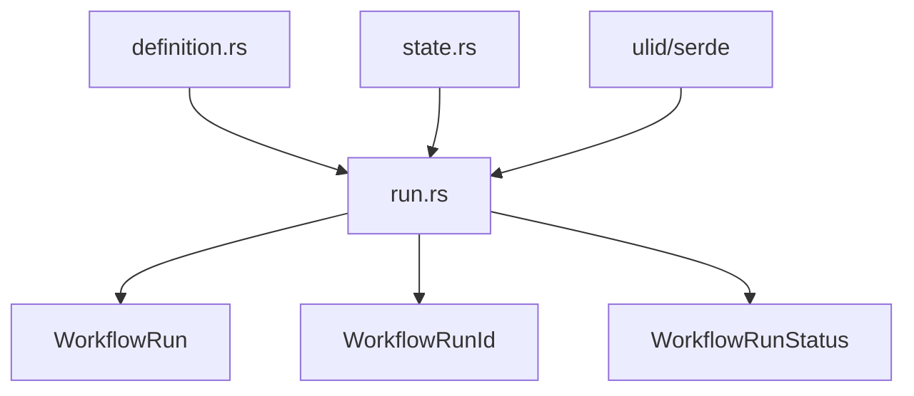

# Migrate Runtime Structures

Refer to /Users/wballard/github/swissarmyhammer/ideas/workflow_move.md

## Objective
Migrate the runtime execution state management module that tracks workflow execution progress and status.

## Module to Migrate
- `run.rs` - WorkflowRun, WorkflowRunId, WorkflowRunStatus types

## Tasks
1. Copy `run.rs` to workflow crate
2. Update any imports to use migrated modules
3. Add to lib.rs exports
4. Verify integration with previously migrated modules
5. Test basic runtime functionality

## Implementation Details

### Expected Exports
```rust
pub use run::{WorkflowRun, WorkflowRunId, WorkflowRunStatus};
```

### Dependencies Check
The `run.rs` module likely depends on:
- Core data structures (definition, state) - already migrated
- Standard library types
- Serialization (serde)
- ID generation (ulid)

### Integration Points
- Must work with `State` types from migrated state.rs
- Must work with `Workflow` types from migrated definition.rs
- Runtime status tracking for execution system

## Mermaid Diagram


## Acceptance Criteria
- [ ] `run.rs` migrated to workflow crate
- [ ] Imports updated to use migrated modules
- [ ] Added to lib.rs exports correctly
- [ ] `cargo check` passes without warnings
- [ ] Basic WorkflowRun instantiation works
- [ ] Integration with core types verified

## Next Step
Step 000007: Migrate graph analysis (graph.rs)