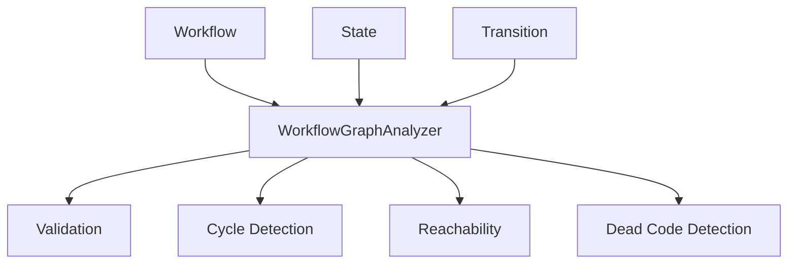

# Migrate Graph Analysis

Refer to /Users/wballard/github/swissarmyhammer/ideas/workflow_move.md

## Objective
Migrate the workflow graph analysis functionality that provides validation and analysis of workflow structure.

## Module to Migrate
- `graph.rs` - WorkflowGraphAnalyzer and related graph analysis functionality

## Tasks
1. Copy `graph.rs` to workflow crate
2. Update imports to reference migrated modules
3. Add to lib.rs exports
4. Verify graph analysis functionality
5. Test against existing workflows

## Implementation Details

### Expected Exports
```rust
pub use graph::{GraphError, GraphResult, WorkflowGraphAnalyzer};
```

### Dependencies
The graph module likely depends on:
- `definition.rs` - For Workflow types
- `state.rs` - For State analysis  
- `transition.rs` - For transition analysis
- Standard collection types (HashMap, etc.)

### Functionality
Graph analysis typically includes:
- Workflow validation (no orphaned states)
- Cycle detection
- Reachability analysis
- Dead code detection

## Mermaid Diagram


## Acceptance Criteria
- [ ] `graph.rs` migrated successfully
- [ ] All imports updated to use migrated modules
- [ ] Graph analysis exports added to lib.rs
- [ ] `cargo check` passes without errors
- [ ] Basic graph analysis functionality works
- [ ] Can analyze workflow structure correctly

## Next Step
Step 000008: Migrate storage layer (storage.rs)