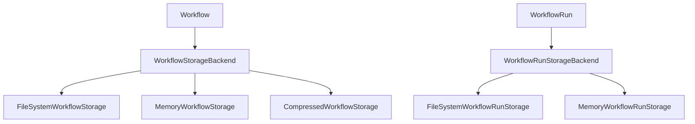

# Migrate Storage Layer

Refer to /Users/wballard/github/swissarmyhammer/ideas/workflow_move.md

## Objective  
Migrate the workflow storage and persistence layer that handles saving and loading workflows and workflow runs.

## Module to Migrate
- `storage.rs` - All storage backend implementations and traits

## Tasks
1. Copy `storage.rs` to workflow crate
2. Update imports to use migrated workflow types
3. Verify storage backend functionality  
4. Add to lib.rs exports
5. Test basic storage operations

## Implementation Details

### Expected Exports (from mod.rs analysis)
```rust
pub use storage::{
    CompressedWorkflowStorage, FileSystemWorkflowRunStorage, FileSystemWorkflowStorage,
    MemoryWorkflowRunStorage, MemoryWorkflowStorage, WorkflowResolver, 
    WorkflowRunStorageBackend, WorkflowStorage, WorkflowStorageBackend,
};
```

### Dependencies
Storage layer depends on:
- `definition.rs` - Workflow types for persistence
- `run.rs` - WorkflowRun types for run storage
- File system operations (std::fs, walkdir)
- Serialization (serde_yaml, serde_json)
- Compression (zstd for CompressedWorkflowStorage)

### Storage Backends
Multiple storage implementations:
- **Memory backends** - For testing and temporary storage
- **FileSystem backends** - For persistent storage
- **Compressed storage** - For space efficiency

## Mermaid Diagram


## Acceptance Criteria
- [ ] `storage.rs` migrated successfully
- [ ] All storage trait implementations preserved
- [ ] Imports updated to use migrated types
- [ ] Storage exports added to lib.rs
- [ ] `cargo check` passes without errors
- [ ] Basic storage operations functional
- [ ] Can save/load workflows and runs

## Next Step
Step 000009: Migrate metrics system (metrics.rs)