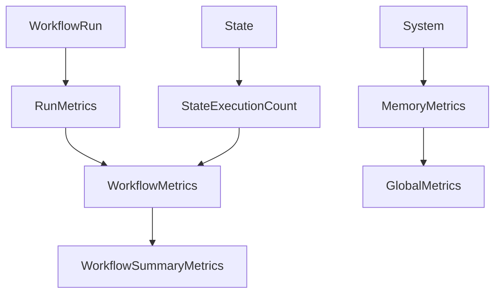

# Migrate Metrics System

Refer to /Users/wballard/github/swissarmyhammer/ideas/workflow_move.md

## Objective
Migrate the workflow metrics and performance monitoring system that tracks execution statistics and resource usage.

## Module to Migrate
- `metrics.rs` - Workflow execution metrics and monitoring

## Tasks
1. Copy `metrics.rs` to workflow crate
2. Update imports for migrated workflow types
3. Verify metrics collection functionality
4. Add to lib.rs exports
5. Test metrics gathering

## Implementation Details

### Expected Exports (from mod.rs analysis)
```rust
pub use metrics::{
    GlobalMetrics, MemoryMetrics, ResourceTrends, RunMetrics, 
    StateExecutionCount, WorkflowMetrics, WorkflowSummaryMetrics,
};
```

### Dependencies
Metrics system likely depends on:
- `run.rs` - For WorkflowRun metrics
- `state.rs` - For state execution tracking
- System monitoring (potentially sysinfo crate)
- Time tracking (chrono)
- Memory usage tracking

### Metrics Types
Based on exports, handles:
- **Global metrics** - System-wide statistics
- **Memory metrics** - Memory usage tracking
- **Resource trends** - Resource usage over time
- **Run metrics** - Per-execution statistics
- **State execution counts** - State-level performance
- **Workflow metrics** - Workflow-level aggregates

## Mermaid Diagram


## Acceptance Criteria
- [ ] `metrics.rs` migrated successfully
- [ ] All metrics types and functionality preserved
- [ ] Imports updated for migrated types
- [ ] Metrics exports added to lib.rs
- [ ] `cargo check` passes without errors
- [ ] Basic metrics collection works
- [ ] Can track workflow execution statistics

## Next Step
Step 000010: Migrate template context (template_context.rs)