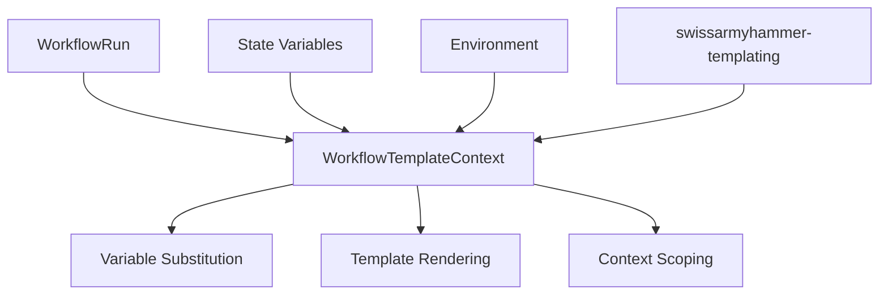

# Migrate Template Context

Refer to /Users/wballard/github/swissarmyhammer/ideas/workflow_move.md

## Objective
Migrate the template context system that provides variable substitution and templating capabilities for workflows.

## Module to Migrate
- `template_context.rs` - WorkflowTemplateContext and template rendering

## Tasks
1. Copy `template_context.rs` to workflow crate
2. Update imports for templating dependencies
3. Verify template rendering functionality
4. Add to lib.rs exports
5. Test template variable substitution

## Implementation Details

### Expected Exports
```rust
pub use template_context::WorkflowTemplateContext;
```

### Dependencies
Template context depends on:
- `swissarmyhammer-templating` - Core templating functionality
- `run.rs` - For workflow run context
- `state.rs` - For state-specific variables
- Liquid templating engine (legacy support)
- Variable management and scoping

### Template Context Features
- Variable substitution in workflow definitions
- Context inheritance between states
- Environment variable access
- Dynamic value resolution
- Template rendering with error handling

## Mermaid Diagram


## Acceptance Criteria
- [ ] `template_context.rs` migrated successfully
- [ ] Template rendering functionality preserved
- [ ] Imports updated for templating system
- [ ] Template context exports added to lib.rs
- [ ] `cargo check` passes without errors
- [ ] Variable substitution works correctly
- [ ] Can render templates with workflow context

## Next Step
Step 000011: Migrate parser (parser.rs)