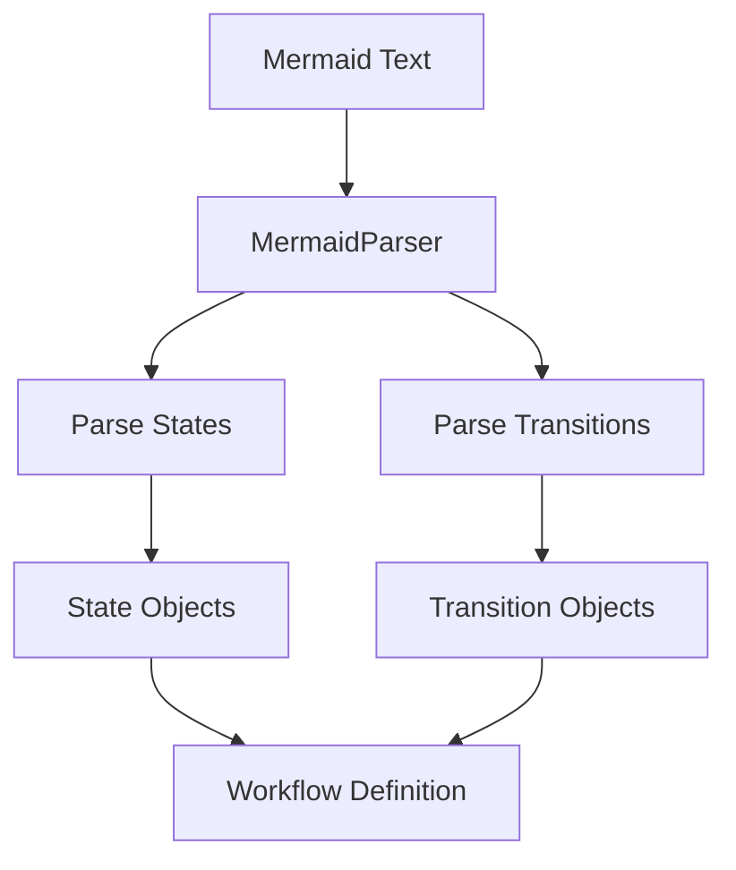

# Migrate Parser

Refer to /Users/wballard/github/swissarmyhammer/ideas/workflow_move.md

## Objective
Migrate the Mermaid diagram parser that converts Mermaid state diagrams into workflow definitions.

## Module to Migrate
- `parser.rs` - MermaidParser and parsing logic

## Tasks
1. Copy `parser.rs` to workflow crate
2. Update imports for definition and parsing types
3. Verify Mermaid parsing functionality
4. Add to lib.rs exports
5. Test parsing with sample Mermaid diagrams

## Implementation Details

### Expected Exports
```rust
pub use parser::{MermaidParser, ParseError, ParseResult};
```

### Dependencies
Parser depends on:
- `definition.rs` - For Workflow types created during parsing
- `state.rs` - For State definitions
- `transition.rs` - For transition parsing
- `mermaid-parser` crate - External Mermaid parsing library
- Error handling types

### Parser Functionality
- Mermaid state diagram syntax parsing
- Workflow definition generation
- State and transition extraction
- Error reporting for invalid syntax
- Integration with workflow definition types

## Mermaid Diagram


## Acceptance Criteria
- [ ] `parser.rs` migrated successfully
- [ ] Mermaid parsing functionality preserved
- [ ] Imports updated for migrated definition types
- [ ] Parser exports added to lib.rs
- [ ] `cargo check` passes without errors
- [ ] Can parse Mermaid diagrams into workflows
- [ ] Error handling works for invalid syntax

## Next Step
Step 000012: Migrate action parser (action_parser.rs)