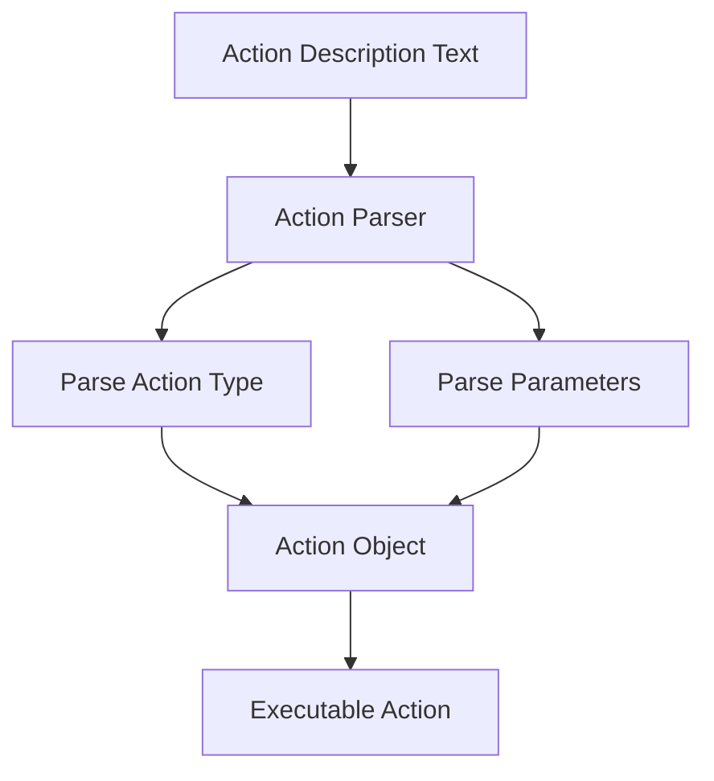

# Migrate Action Parser

Refer to /Users/wballard/github/swissarmyhammer/ideas/workflow_move.md

## Objective
Migrate the action parser that converts action descriptions into executable action objects using parser combinators.

## Module to Migrate
- `action_parser.rs` - Action parsing logic using chumsky parser combinators

## Tasks
1. Copy `action_parser.rs` to workflow crate
2. Update imports for action types and parsing dependencies
3. Verify action parsing functionality
4. Add to lib.rs exports if needed (may be internal)
5. Test parsing various action descriptions

## Implementation Details

### Dependencies
Action parser depends on:
- `actions.rs` - For Action types (will be migrated in next phase)
- `chumsky` crate - Parser combinator library
- Error types for parse failures
- Template context for variable resolution

### Parser Functionality
- Parses natural language action descriptions
- Converts text to structured Action objects
- Handles various action types (shell, prompt, log, etc.)
- Parameter extraction and validation
- Error reporting for invalid action syntax

### Integration Points
- Used by workflow execution system
- Integrates with action system (next step)
- May be used by Mermaid parser for action nodes

## Mermaid Diagram

## Acceptance Criteria
- [ ] `action_parser.rs` migrated successfully
- [ ] Parser combinator functionality preserved
- [ ] Imports updated for dependencies
- [ ] `cargo check` passes without errors
- [ ] Can parse action descriptions correctly
- [ ] Error handling works for invalid syntax
- [ ] Integration points identified for next steps

## Next Step
Step 000013: Migrate actions system (actions.rs)