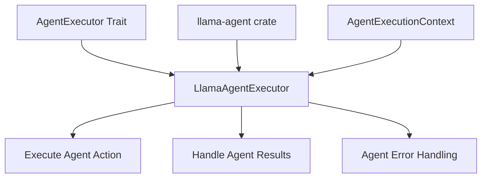

# Migrate Agent System

Refer to /Users/wballard/github/swissarmyhammer/ideas/workflow_move.md

## Objective
Migrate the agent execution system that handles AI agent interactions and LLM integrations.

## Modules to Migrate
- `agents/mod.rs` - Agent module structure
- `agents/llama_agent_executor.rs` - LlamaAgent integration

## Tasks
1. Create `agents/` directory in workflow crate
2. Copy `agents/mod.rs` and `llama_agent_executor.rs`
3. Update imports for llama-agent integration
4. Add agent exports to lib.rs
5. Test agent execution functionality

## Implementation Details

### Expected Exports
```rust
pub use agents::LlamaAgentExecutor;
```

### Dependencies
Agent system depends on:
- `llama-agent` crate - External AI agent library
- `actions.rs` - For AgentExecutor traits
- Async runtime (tokio)
- Error handling
- Potentially MCP integration

### Agent Functionality
- AI agent execution context
- LLM integration for workflow steps
- Agent factory pattern
- Execution result handling
- Error propagation from agent failures

## Mermaid Diagram


## Acceptance Criteria
- [ ] `agents/` directory structure migrated
- [ ] LlamaAgent integration preserved
- [ ] Imports updated for external agent library
- [ ] Agent exports added to lib.rs
- [ ] `cargo check` passes without errors
- [ ] Agent executor can be instantiated
- [ ] Basic agent execution context works

## Next Step
Step 000015: Migrate MCP integration (mcp_integration.rs)