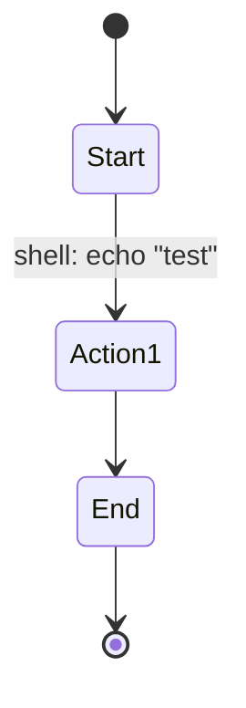

# Integration Verification and Core Testing

Refer to /Users/wballard/github/swissarmyhammer/ideas/workflow_move.md

## Objective
Verify that all migrated core components integrate correctly and establish a working baseline before test migration.

## Tasks
1. Create integration test to verify all components work together
2. Test basic workflow creation, parsing, and execution
3. Verify all public APIs are correctly exported
4. Test cross-module dependencies and imports
5. Establish baseline functionality before test migration

## Implementation Details

### Integration Test Areas
- Workflow parsing from Mermaid → Definition
- Action creation and execution
- State transitions and execution
- Storage and persistence
- Template context and variable substitution
- Agent execution integration
- MCP tool integration

### Test Workflow Example

### Verification Points
- Can parse test workflow successfully
- Can create workflow executor
- Can execute simple workflow
- All action types instantiate correctly
- Storage backends work
- Metrics collection functional

## Acceptance Criteria
- [ ] Integration test passes
- [ ] All core functionality verified working
- [ ] No missing dependencies or imports
- [ ] Public API exports complete and correct
- [ ] Basic workflow execution successful
- [ ] Ready for test migration phase

## Next Phase
Begin test migration starting with Step 000019: Migrate core tests