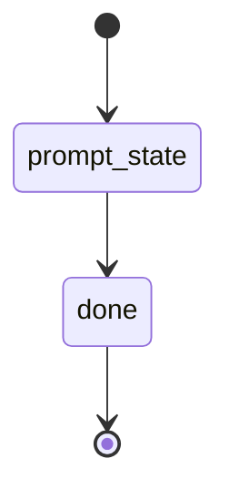

## States

```mermaid
stateDiagram-v2
    [*] --> prompt_state
    prompt_state --> done
    done --> [*]
```

## Actions

- prompt_state: execute prompt "are_tests_passing"  
  Store As: my_result
- done: log "Complete"

