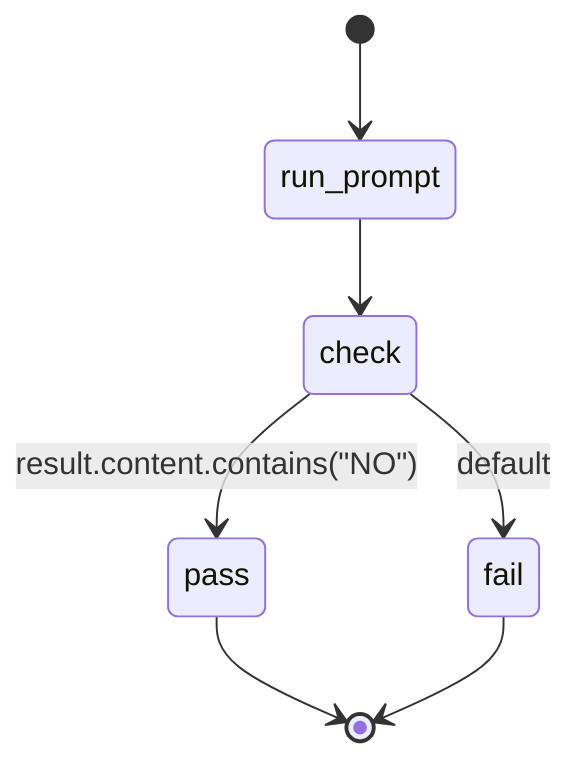

## States

```mermaid
stateDiagram-v2
    [*] --> run_prompt
    run_prompt --> check
    check --> pass: result.content.contains("NO")
    check --> fail: default
    pass --> [*]
    fail --> [*]
```

## Actions

- run_prompt: execute prompt "are_tests_passing"
- check: loop
- pass: log "SUCCESS: found NO in result.content"
- fail: log "FAIL: could not access result.content"

