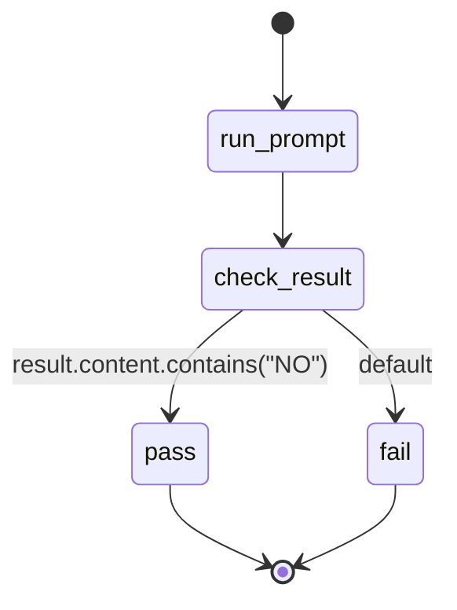

## States

```mermaid
stateDiagram-v2
    [*] --> run_prompt
    run_prompt --> check_result
    check_result --> pass: result.content.contains("NO")
    check_result --> fail: default
    pass --> [*]
    fail --> [*]
```

## Actions

- run_prompt: execute prompt "are_tests_passing"
- check_result: loop
- pass: log "Found NO in result.content"
- fail: log "Failed to access result.content"

