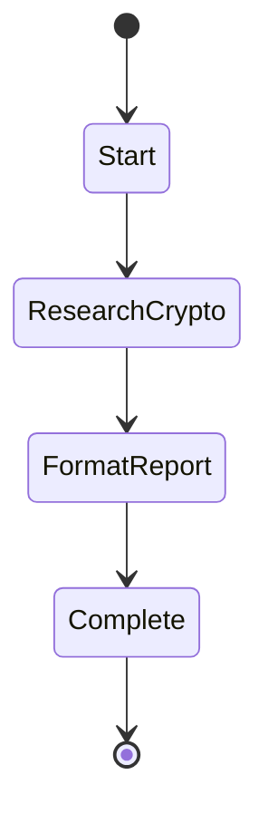

<div align="center">


# SwissArmyHammer

**The only coding assistant you'll ever need. Write specs, not code.**

📚 **[Complete Documentation & Guides](https://swissarmyhammer.github.io/swissarmyhammer)** 📚

[](https://github.com/swissarmyhammer/swissarmyhammer/actions)
[](LICENSE)
[](https://www.rust-lang.org/)
[](https://github.com/anthropics/model-context-protocol)

[📖 Documentation](https://swissarmyhammer.github.io/swissarmyhammer)

</div>

---

## 🎯 Why SwissArmyHammer?

**Tired of babysitting AI while it codes? Want to describe what you want and come back to finished software?**

SwissArmyHammer is the **full-featured coding assistant** that works while you sleep. Write a simple spec, kick off a workflow, and return to find your project implemented, tested, and ready to ship.

### 🚀 **Set It and Forget It Coding**
- Write a 4-sentence spec in markdown
- Run `sah`
- Go get coffee (or take a nap)
- Return to a fully implemented, tested CLI application

### 🛠️ **Complete MCP Tool Suite**
SwissArmyHammer **IS** an MCP server with 25+ professional-grade tools:
- **File Operations** - Read, write, edit, search across any codebase
- **Git Integration** - Branch management, commit workflows, PR automation
- **Issue Tracking** - Built-in project management with markdown files
- **Semantic Search** - Vector-powered code understanding and navigation
- **Web Integration** - Fetch docs, search APIs, gather requirements
- **Shell Execution** - Safe, controlled system interaction
- **Memory System** - Persistent context and note-taking

### 🧠 **Agentic Intelligence**
- **Multi-hour autonomous execution** without human intervention
- **Planning and replanning** as requirements evolve
- **Error recovery** and self-correction
- **Context preservation** across long-running tasks
- **Tool orchestration** that rivals human developers

### 📝 **Markdown-Driven Everything**
- **Prompts** are markdown files with Liquid templating
- **Workflows** are state machines defined in markdown
- **Issues** are tracked as markdown files in your repo
- **Specs** are simple markdown documents
- **No databases, no cloud, no lock-in** - just files

### ⚡ **Industrial Strength**
Built for real software development, not toy examples:
- **Rust-powered** performance and reliability
- **Type-safe** tool integration
- **Memory-efficient** for large codebases
- **Battle-tested** on production systems

## 🏃‍♂️ Get Started in 5 Minutes

**Build a weather CLI that fetches data from OpenWeatherMap - from idea to working code in minutes:**

### 1. Installation
```bash
# Install SwissArmyHammer
cargo install --git https://github.com/swissarmyhammer/swissarmyhammer swissarmyhammer-cli

# Add to Claude Code as MCP server
claude mcp add --scope user sah sah serve
```

### 2. Create Your Project
```bash
# Set up a new project
mkdir weather-cli && cd weather-cli
git init
```

### 3. Write Your Spec (30 seconds)
Create `spec.md`:
```markdown
# Weather CLI

Build a command-line tool that fetches current weather for any city using the OpenWeatherMap API.
The CLI should accept a city name as an argument and display temperature, humidity, and conditions in a clean format.
Include error handling for invalid cities and network issues.
Add configuration for API key via environment variable or config file.
Include basic tests and a README with usage examples.
```

### 4. Let SwissArmyHammer Build It
```bash
# Plan the implementation from your spec
sah plan spec.md

# Let SwissArmyHammer implement everything autonomously
sah implement
```

### 5. Watch the Magic ✨
SwissArmyHammer will autonomously:
- Break down your spec into focused development issues
- Initialize a Rust CLI project with proper structure
- Implement HTTP client for OpenWeatherMap API
- Add command-line argument parsing with clap
- Handle configuration and environment variables
- Write comprehensive error handling
- Create unit and integration tests
- Generate documentation and usage examples
- Work through each issue systematically until complete

**No chatting. No hand-holding. No babysitting. Just working software.**

---

**That's the power of SwissArmyHammer - from idea to implementation while you focus on what matters.**

## 🎯 What Makes SwissArmyHammer Different

### **Real Autonomy, Not Chat Theater**
Other AI coding tools make you supervise every step. SwissArmyHammer works like a senior developer - give it requirements and check back when it's done.

### **Production-Ready from Day One**
- **File-based architecture** - No databases, no cloud dependencies
- **Git-native workflows** - Branches, commits, and PRs handled automatically
- **Industrial tooling** - Shell execution, file operations, web integration
- **Type-safe everywhere** - Rust's safety guarantees throughout

### **MCP Integration Leader**
SwissArmyHammer pioneered comprehensive MCP server implementation:
- **40+ professional tools** available to any MCP client
- **Semantic code search** with vector embeddings
- **Workflow orchestration** across tool boundaries
- **Context preservation** spanning hours of work

### **Markdown-Driven Development**
Everything is a markdown file you can read, edit, and version control:
- **Prompts** with Liquid templating and variables
- **Workflows** as state machines with visual diagrams
- **Issues** tracked in your repository
- **Specs** that become working software

### **Built for Scale**
- **Memory-efficient** operation on large codebases
- **Incremental processing** - only analyze what changed
- **Parallel execution** where safe
- **Resource controls** prevent runaway processes

---

## 🎮 Build Your First Workflow

**Create a fun "Daily Crypto Report" workflow that fetches live data and generates a formatted report.**

SwissArmyHammer workflows aren't just for coding - you can build multi-step agents for any task using nothing but markdown files.

### 1. Create a Research Prompt
```bash
mkdir -p ~/.swissarmyhammer/prompts
cat > ~/.swissarmyhammer/prompts/crypto-research.md << 'EOF'
---
title: Crypto Research
description: Research cryptocurrency information
arguments:
  - name: symbol
    description: Crypto symbol (e.g. BTC, ETH)
    required: true
---

Research the cryptocurrency {{symbol}}:

1. Use web_fetch to get current price and market data from CoinGecko API: `https://api.coingecko.com/api/v3/simple/price?ids={{symbol | downcase}}&vs_currencies=usd&include_24hr_change=true&include_market_cap=true`

2. Use web_search to find recent news about {{symbol}} cryptocurrency

3. Analyze the collected data and create a comprehensive research summary

4. Use memo_create to save your research with title "{{symbol}} Research Data" so it can be used for the final report

Include: current price, 24h change, market cap, recent news highlights, and key developments.
EOF
```

### 2. Create a Report Formatter Prompt
```bash
cat > ~/.swissarmyhammer/prompts/format-report.md << 'EOF'
---
title: Format Report
description: Format crypto research into a beautiful report
arguments:
  - name: symbol
    description: Crypto symbol for the report
    required: true
---

Create a beautiful daily crypto report for {{symbol}}:

1. Use memo_search to find the research data for "{{symbol}} Research Data"

2. Transform the research into a professional daily report with:
   - 📊 Executive summary
   - 💰 Key metrics table (price, change, market cap)
   - 📈 Trend analysis
   - ⚠️ Risk assessment
   - 💡 Final recommendation

3. Use professional formatting with emojis and clear sections

4. Save the final report using file_write as "daily-{{symbol}}-report.md"
EOF
```

### 3. Create the Workflow
```bash
mkdir -p ~/.swissarmyhammer/workflows
cat > ~/.swissarmyhammer/workflows/crypto-report.md << 'EOF'
---
name: crypto-report
title: Daily Crypto Report
description: Generate comprehensive cryptocurrency reports
arguments:
  - name: crypto
    description: Cryptocurrency symbol to research
    default: "BTC"
---

# Daily Crypto Report Workflow



## Actions

- Start: Log "Starting crypto report for ${crypto}"
- ResearchCrypto: Execute prompt "crypto-research" with symbol="${crypto}"
- FormatReport: Execute prompt "format-report" with symbol="${crypto}"
- Complete: Log "Crypto report completed and saved as daily-${crypto}-report.md"
EOF
```

### 4. Run Your Workflow
```bash
# Generate report for Bitcoin
sah flow run crypto-report --crypto "BTC"

# Or try different cryptos
sah flow run crypto-report --crypto "ETH"
sah flow run crypto-report --crypto "SOL"
```

**This workflow demonstrates SwissArmyHammer's power:**
- **Web integration** - Fetches live API data and searches news
- **Prompt orchestration** - Chains research and formatting prompts
- **File operations** - Saves professional reports
- **Memory management** - Passes data between workflow states
- **Parameterization** - Customizable with different crypto symbols

**The result:** A beautiful daily crypto report with live data, news analysis, and professional formatting - all from a simple markdown workflow file.

---

**Ready to automate your world? Install SwissArmyHammer and start building workflows that work while you sleep.** 🚀
