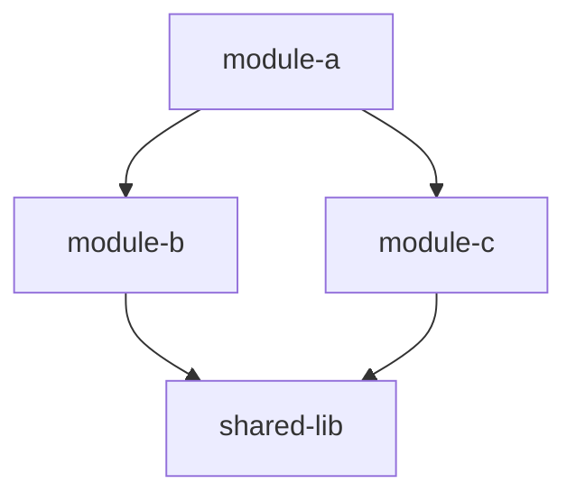
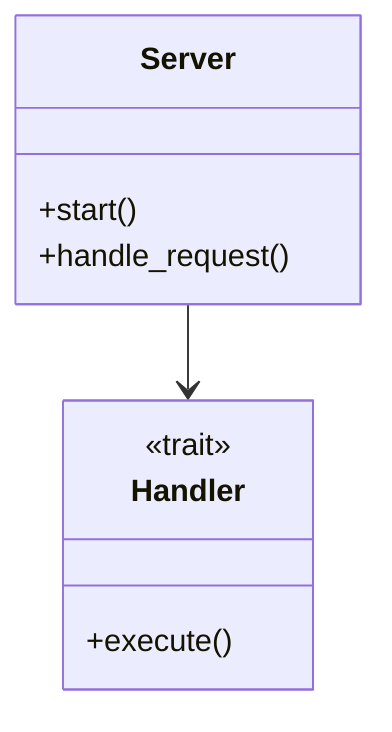
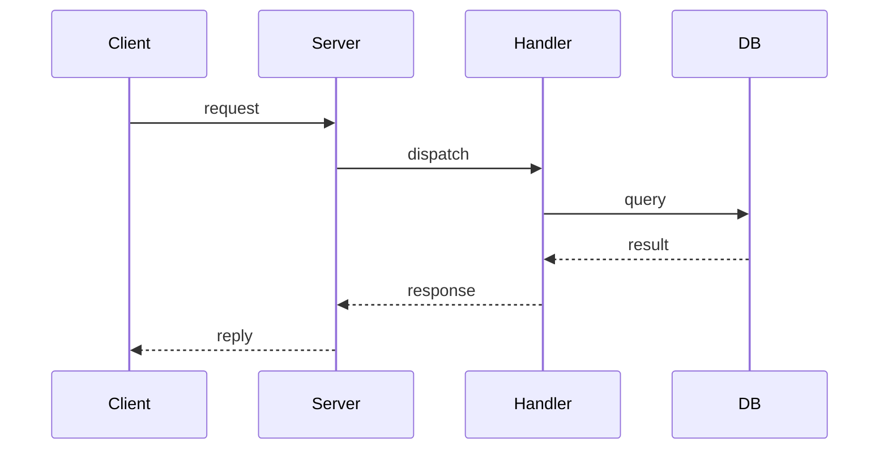
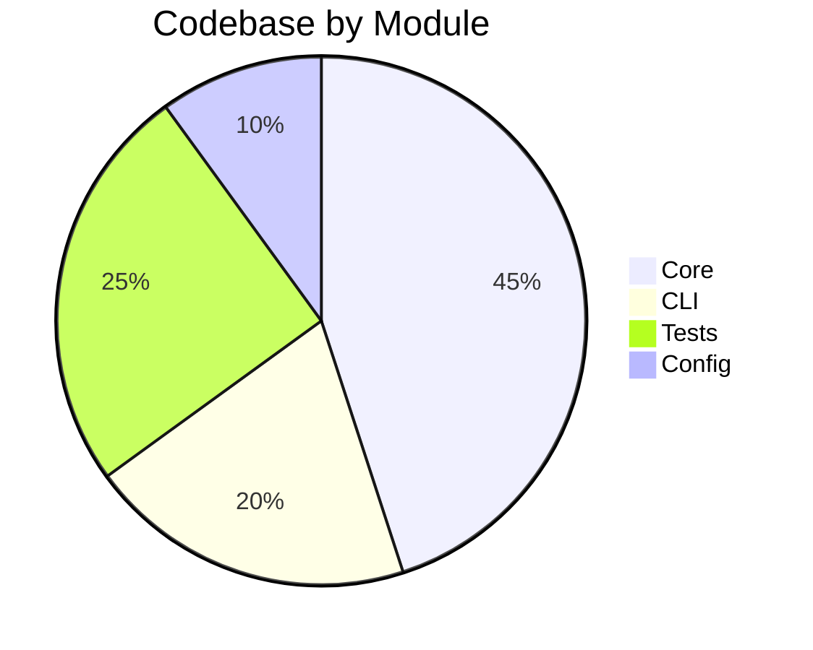

# Map Codebase

Generate a visual architecture overview and write `ARCHITECTURE.md` at the repo root.

## Process

### 1. Check index status

```json
{"op": "get status"}
```

If TS or LSP indexing < 90%, wait and re-check — map quality depends on a fully indexed codebase.

### 2. Gather structural data

**File inventory** + scale (use `get status` counts):
```json
{"op": "grep code", "pattern": ".", "max_results": 1}
```

**Key symbols** — major types, traits, entry points:
```json
{"op": "search symbol", "kind": "struct", "query": "", "max_results": 50}
{"op": "search symbol", "kind": "function", "query": "main", "max_results": 10}
{"op": "search symbol", "kind": "trait", "query": "", "max_results": 30}
{"op": "search symbol", "kind": "class", "query": "", "max_results": 30}
{"op": "search symbol", "kind": "interface", "query": "", "max_results": 30}
```

**Module structure**:
```json
{"op": "list symbols", "file_path": "<entry-point>"}
```

**Call graph** from entry points:
```json
{"op": "get callgraph", "symbol": "<entry-point>", "direction": "outbound", "max_depth": 2}
```

**Dependencies**:
```json
{"op": "get blastradius", "file_path": "<key-file>", "max_hops": 2}
```

### 3. Read project config

`Cargo.toml` / `package.json` / `go.mod` / `pyproject.toml`, and entry points (`main.rs`, `lib.rs`, `index.ts`, `main.go`, etc.).

### 4. Write `ARCHITECTURE.md`

Sections (each must include at least one Mermaid diagram where applicable):

**Header**:

```markdown
# Architecture

> Auto-generated by SwissArmyHammer `/map` — [timestamp]

## Overview

[2-3 sentences: what this is, what it does, language/framework]
```

**Module/Package Dependencies** (`graph TD`) — group by layer when there are clear layers (CLI → core → data):

````markdown

````

**Key Types and Relationships** (`classDiagram`) — focus on 10–20 most important types:

````markdown

````

**Key Flows** (`sequenceDiagram`) — 1–3 critical paths (request handling, data pipeline, build):

````markdown

````

**Codebase Composition** (`pie`):

````markdown

````

**Directory Structure** — annotated tree of top-level dirs.

**Symbol Index** — table of major public types/functions grouped by module:

```markdown
| Module | Symbol | Kind | Description |
|--------|--------|------|-------------|
| server | Server | struct | Main server instance |
| server | start | fn | Entry point |
| handler | Handler | trait | Request handler interface |
```

### 5. Summary

```
Wrote ARCHITECTURE.md

- [N] modules/packages mapped
- [N] key types documented
- [N] flows diagrammed
- [N] Mermaid diagrams generated

Diagrams render on GitHub, VS Code, Obsidian.
```

## Rules

- Always write to repo root; overwrite if exists.
- Every section gets at least one Mermaid diagram.
- Diagrams must be valid Mermaid that renders on GitHub.
- Architecture, not implementation — show the forest.
- Back every claim with a query result, not a guess.
- Monorepo/workspace: workspace view first, then drill into key packages.
- **Scoped mapping**: the user requested `{{ arguments }}`. Scope queries and output to that subdirectory or module.
- Path/module argument → scope the map.
- Keep under 500 lines. Be selective.
