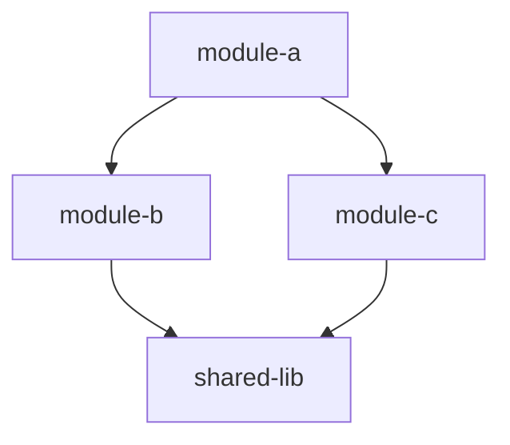
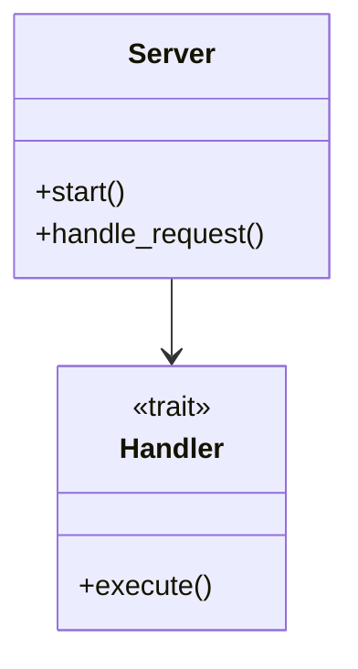
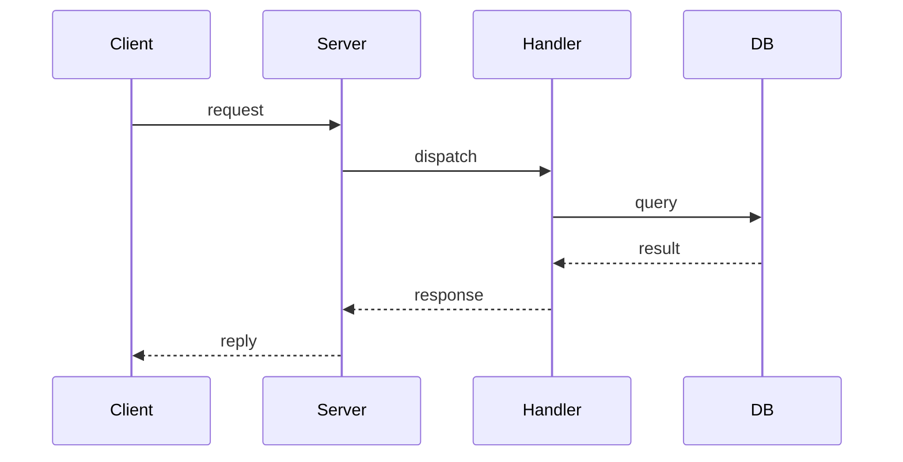
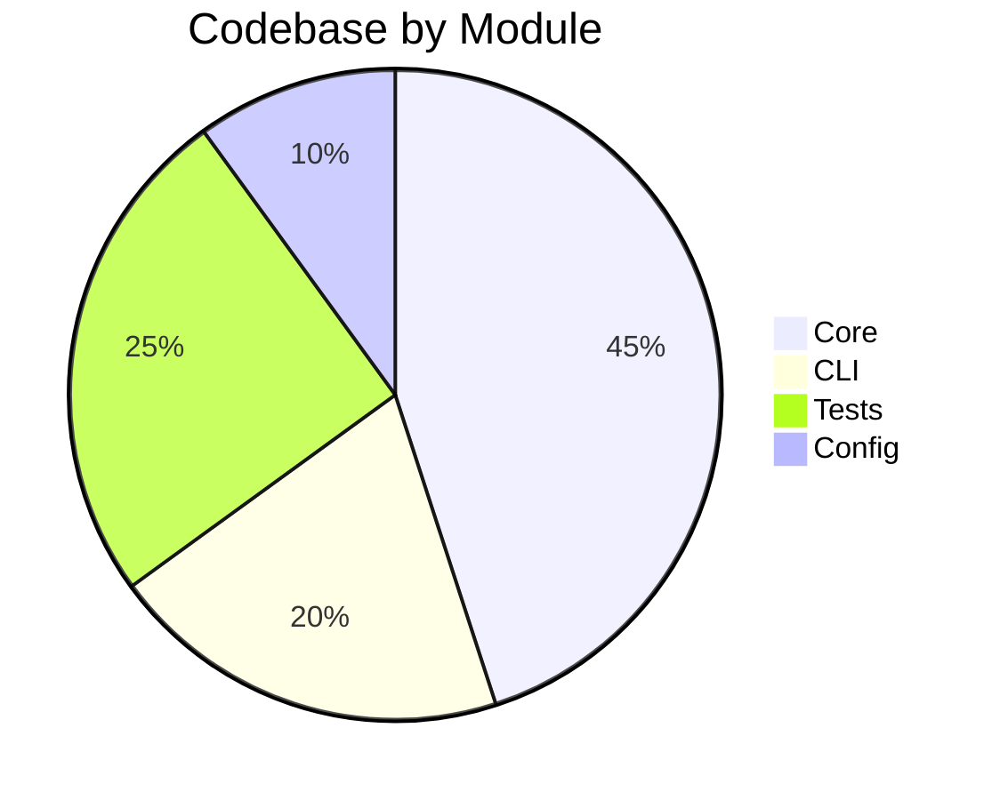

# Map Codebase

Generate a visual architecture overview. Write `ARCHITECTURE.md` at the repository root.

## Process

Use the `code_context` MCP tool to explore the codebase structure, the key types, and the call graphs. Use Mermaid syntax for diagrams, so they render on GitHub.

### 1. Check index status

```json
{"op": "get status"}
```

If TS or LSP indexing is under 90%, wait, then check again. Map quality depends on a fully indexed codebase.

### 2. Gather structural data

**File inventory and scale** (use the `get status` counts):
```json
{"op": "grep code", "pattern": ".", "max_results": 1}
```

**Key symbols**: the major types, traits, and entry points:
```json
{"op": "search symbol", "kind": "struct", "query": "", "max_results": 50}
{"op": "search symbol", "kind": "function", "query": "main", "max_results": 10}
{"op": "search symbol", "kind": "trait", "query": "", "max_results": 30}
{"op": "search symbol", "kind": "class", "query": "", "max_results": 30}
{"op": "search symbol", "kind": "interface", "query": "", "max_results": 30}
```

**Module structure**:
```json
{"op": "list symbols", "file_path": "<entry-point>"}
```

**Call graph** from entry points:
```json
{"op": "get callgraph", "symbol": "<entry-point>", "direction": "outbound", "max_depth": 2}
```

**Dependencies**:
```json
{"op": "get blastradius", "file_path": "<key-file>", "max_hops": 2}
```

### 3. Read project config

Read the project config, for example `Cargo.toml`, `package.json`, `go.mod`, or `pyproject.toml`. Also read the entry points, for example `main.rs`, `lib.rs`, `index.ts`, or `main.go`.

### 4. Write `ARCHITECTURE.md`

Write these sections. Each section must include at least one Mermaid diagram, where a diagram applies:

**Header**:

```markdown
# Architecture

> Auto-generated by SwissArmyHammer `/map` — [timestamp]

## Overview

[2-3 sentences: what this is, what it does, language/framework]
```

**Module/Package Dependencies** (`graph TD`). Group nodes by layer when there are clear layers, for example CLI, then core, then data:

````markdown

```mermaid
graph TD
    A[module-a] --> B[module-b]
    A --> C[module-c]
    B --> D[shared-lib]
    C --> D
```
````

**Key Types and Relationships** (`classDiagram`). Focus on the 10 to 20 most important types:

````markdown

```mermaid
classDiagram
    class Server {
        +start()
        +handle_request()
    }
    class Handler {
        <<trait>>
        +execute()
    }
    Server --> Handler
```
````

**Key Flows** (`sequenceDiagram`). Show 1 to 3 critical paths, for example request handling, the data pipeline, or the build:

````markdown

```mermaid
sequenceDiagram
    participant Client
    participant Server
    participant Handler
    participant DB
    Client->>Server: request
    Server->>Handler: dispatch
    Handler->>DB: query
    DB-->>Handler: result
    Handler-->>Server: response
    Server-->>Client: reply
```
````

**Codebase Composition** (`pie`):

````markdown

```mermaid
pie title Codebase by Module
    "Core" : 45
    "CLI" : 20
    "Tests" : 25
    "Config" : 10
```
````

**Directory Structure** — an annotated tree of the top-level directories.

**Symbol Index**: a table of the major public types and functions, grouped by module:

```markdown
| Module | Symbol | Kind | Description |
|--------|--------|------|-------------|
| server | Server | struct | Main server instance |
| server | start | fn | Entry point |
| handler | Handler | trait | Request handler interface |
```

### 5. Summary

```
Wrote ARCHITECTURE.md

- [N] modules/packages mapped
- [N] key types documented
- [N] flows diagrammed
- [N] Mermaid diagrams generated

Diagrams render on GitHub, VS Code, Obsidian.
```

## Rules

- Always write the file to the repository root. Overwrite the file if it already exists.
- Every section gets at least one Mermaid diagram.
- Diagrams must be valid Mermaid that renders on GitHub.
- Show the architecture, not the implementation. Show the forest, not the trees.
- Back every claim with a query result, not a guess.
- For a monorepo or workspace, show the workspace view first, then go deeper into the key packages.
- **Scoped mapping**: the user requested `{{ arguments }}`. Scope your queries and your output to that subdirectory or module.
- A path or module argument scopes the map.
- Keep under 500 lines. Be selective.
