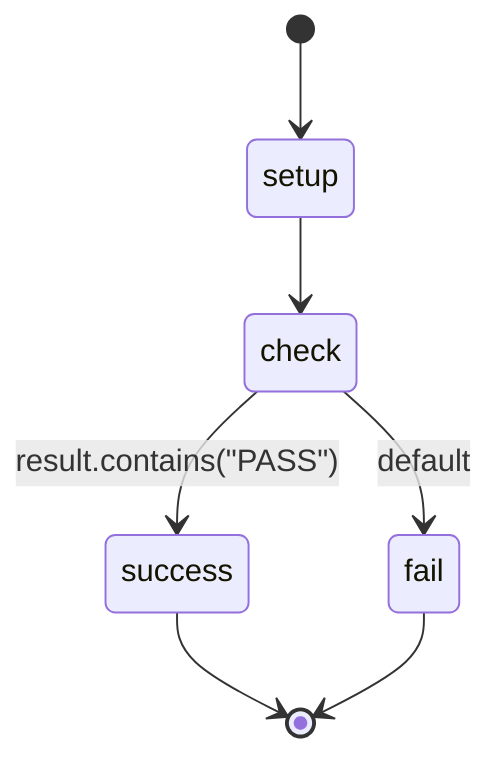

## States

## Actions

- setup: set result="PASS"
- check: log "checking result"  
- success: log "Found PASS in result!"
- fail: log "Did not find PASS in result"

## Description

This workflow tests if CEL expressions work with simple result matching.