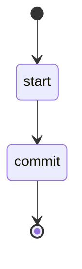

## States

## Actions

- start: log "Preparing to commit changes"
- commit: execute prompt "commit"

## Description

This workflow commits your code changes to the current git branch.

The workflow executes the `commit` prompt which:
1. Evaluates the current git status
2. Cleans up scratch and temporary files
3. Stages all modified and new source files (excluding scratch files)
4. Creates a conventional commit message
5. Commits the changes
6. Reports the commit status

The commit message follows the [Conventional Commits](https://www.conventionalcommits.org/en/v1.0.0/#summary) specification.
