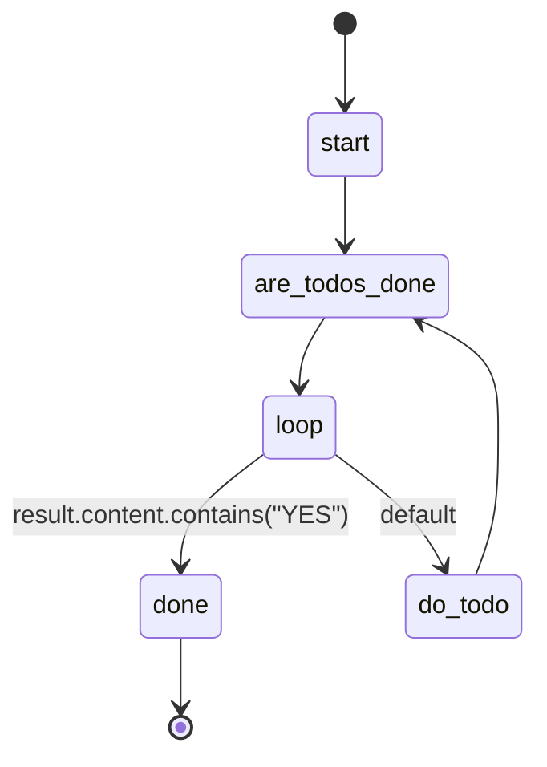

## States

## Actions

- start: log "Working through todos"
- are_todos_done: execute prompt "are_todos_done"
- do_todo: execute prompt "do_todo"
- done: log "All todos complete!"

## Description

This workflow iterates through all pending todo items, completing them one by one until no todos remain.

The workflow uses the `are_todos_done` prompt to check if any pending todos exist by:
1. Using the `todo_show` tool with `item: "next"` to get the next incomplete todo
2. Returning "YES" if no pending todos exist
3. Returning "NO" if there are pending todos

The `do_todo` prompt then:
1. Gets the next todo using `todo_show` with `item: "next"`
2. Reads the context and task description
3. Performs the work to complete the todo
4. Uses `todo_mark_complete` to mark it as done

This cycle continues until the `are_todos_done` prompt confirms no todos remain with a "YES" response.
