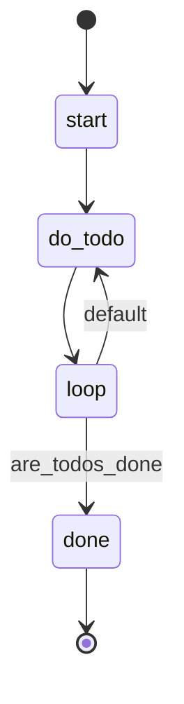

## States

## Actions

- start: log "Working through todos"
- do_todo: execute prompt "do_todo"
- done: log "All todos complete!"

## Description

This workflow iterates through all pending todo items, completing them one by one until no todos remain.
