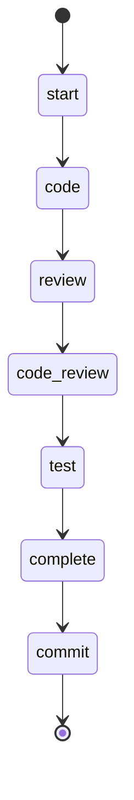

## States

## Actions

- start: log "Working an issue"
- code: execute prompt "issue/code"
- review: execute prompt "issue/review"
- code_review: execute prompt "issue/code_review"
- test: run workflow "tdd"
- complete: execute prompt "issue/complete"
- commit: execute prompt "commit"

## Description

This workflow works an issue until it is completely resolved, tested, and reviewed.
