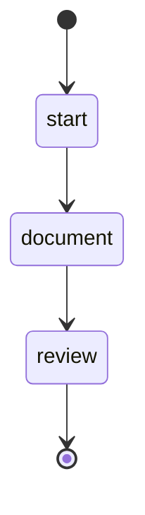

## States

## Actions

- start: log "Documenting"
- document: execute prompt "docs/project"
- review: run workflow "review_docs"
- done: log "Complete"

## Description

This workflow documents and reviews the documentation.
