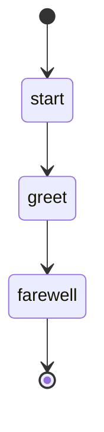

# Hello World Workflow

This is a simple workflow that demonstrates basic workflow functionality with optional parameters.

## Usage

All parameters can be provided via CLI switches or interactive prompting:

```bash
# Simple usage (uses USERNAME environment variable)
sah flow run hello-world

# CLI switches
sah flow run hello-world --person-name "Alice" --language "Spanish" --enthusiastic

# Interactive mode
sah flow run hello-world --interactive

# Variable parameter support
sah flow run hello-world --var person_name=John --var language=English
```

## States



## Actions

- start: Log "Starting hello-world workflow!"
- greet: Execute prompt "say-hello" with name="{{ person_name }}" language="{{ language | default: 'English' }}" enthusiastic=true
- farewell: Log "Goodbye, {{ person_name }}!"

## Description

This workflow demonstrates:

1. **Start State**: Logs a welcome message with optional enthusiastic formatting
2. **Greet State**: Executes a prompt with structured parameters
   - `person_name` - The name to greet (optional string parameter, defaults to USERNAME environment variable)
   - `language` - The language choice with default fallback (optional choice parameter)
   - `enthusiastic` - Whether to use enthusiastic greeting (optional boolean parameter)
3. **Farewell State**: Logs a goodbye message using template variables

The structured parameters are resolved before liquid template rendering, providing type safety, validation, and improved CLI experience with auto-generated help and interactive prompting.
