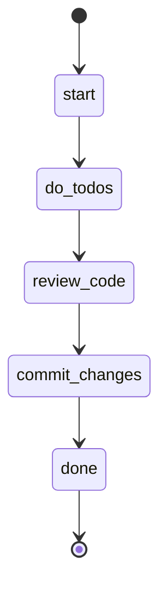

## States



## Actions

- start: log "Starting implementation workflow: do → review → commit"
- do_todos: run workflow "do"
- review_code: run workflow "review"
- commit_changes: execute prompt "commit"
- done: log "Implementation complete: all todos done, code reviewed, and changes committed!"

## Description

This workflow provides a complete implementation cycle by chaining together three key workflows:

1. **Do Todos** - Works through all pending todo items autonomously
2. **Review Code** - Runs rules checks on changed files and fixes violations
3. **Commit Changes** - Creates a conventional commit with all changes

### When to Use

Use this workflow when you want to:
- Complete a feature or fix with proper quality checks
- Ensure code meets standards before committing
- Automate the entire development cycle from task to commit

### Workflow Steps

#### Step 1: Do Todos
The `do` workflow iterates through all pending todos:
- Gets the next incomplete todo
- Reads the task description and context
- Completes the work
- Marks the todo as complete
- Repeats until no todos remain

#### Step 2: Review Code
The `review` workflow ensures code quality:
- Runs rules checks on changed files
- Creates todos for any violations found
- Runs the `do` workflow to fix violations
- Runs tests to verify fixes
- Repeats until all rules pass

#### Step 3: Commit Changes
The `commit` prompt finalizes the work:
- Evaluates git status
- Cleans up scratch files
- Stages all relevant changes
- Creates a conventional commit message
- Commits the changes

### Requirements

- At least one pending todo to start the workflow
- Rules configured for code review (optional but recommended)
- Git repository initialized
- Clean working directory (no uncommitted scratch files)

### Example Usage

```bash
sah flow implement
```

This will autonomously complete all todos, review the code for rule violations, fix any issues, and commit the final changes with a proper commit message.
