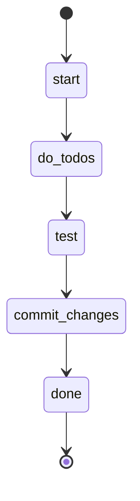

## States



## Actions

- start: log "Starting implementation workflow: do → test → commit"
- do_todos: run workflow "do"
- test: run workflow "test"
- commit_changes: execute prompt "commit"
- done: log "Implementation complete: all todos done, tests run, and changes committed!"

## Description

This workflow provides a complete implementation cycle by chaining together three key workflows:

1. **Do Todos** - Works through all pending todo items autonomously
2. **Test** - Runs tests to verify the implementation
3. **Commit Changes** - Creates a conventional commit with all changes

### When to Use

Use this workflow when you want to:
- Complete a feature or fix with proper testing
- Ensure tests pass before committing
- Automate the entire development cycle from task to commit

### Workflow Steps

#### Step 1: Do Todos
The `do` workflow iterates through all pending todos:
- Gets the next incomplete todo
- Reads the task description and context
- Completes the work
- Marks the todo as complete
- Repeats until no todos remain

#### Step 2: Test
The `test` workflow verifies the implementation:
- Runs the project test suite
- Reports any failures

#### Step 3: Commit Changes
The `commit` prompt finalizes the work:
- Evaluates git status
- Cleans up scratch files
- Stages all relevant changes
- Creates a conventional commit message
- Commits the changes

### Requirements

- At least one pending todo to start the workflow
- Git repository initialized
- Clean working directory (no uncommitted scratch files)

### Example Usage

```bash
sah flow implement
```

This will autonomously complete all todos, run tests, and commit the final changes with a proper commit message.
