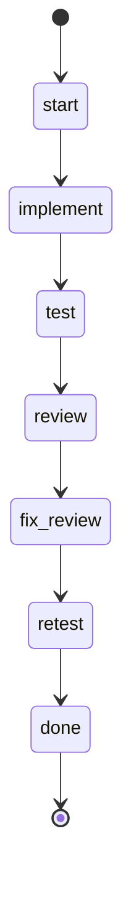

## States

```mermaid
stateDiagram-v2
    [*] --> start
    start --> implement
    implement --> test
    test --> review
    review --> fix_review
    fix_review --> retest
    retest --> done
    done --> [*]
```

## Actions

- start: log "Starting implementation workflow"
- implement: prompt "use the implement skill"
- test: prompt "use the test skill"
- review: prompt "use the review skill"
- fix_review: prompt "Implement all kanban cards tagged review-finding. Use `kanban` with `op: 'next task'`, `tag: 'review-finding'` to pick up each card. Fix the issue, complete the card, and repeat until no review-finding cards remain."
- retest: prompt "use the test skill"
- done: log "Implementation complete!"

## Description

This workflow provides a complete implementation cycle:

1. **Implement** — Pick up the next kanban card and do the work
2. **Test** — Run the full test suite, fix failures
3. **Review** — Code review the changes, generate kanban cards for findings
4. **Fix Review** — Implement the cards generated by the review
5. **Retest** — Run tests again to verify the review fixes
