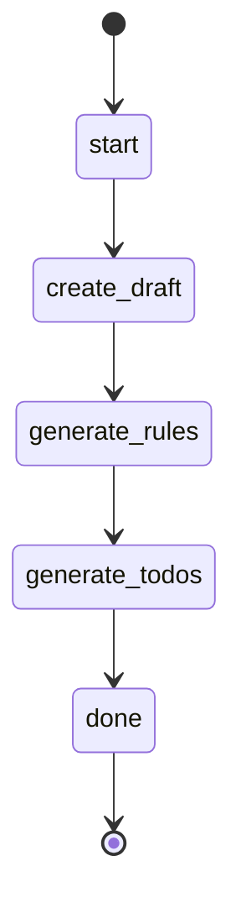

# Planning Workflow

This workflow processes specification files and generates detailed implementation plans.

## States

## Actions

- start: log "Making the plan {{ plan_filename }}"
- create_draft: execute prompt "create-draft-plan" with plan_filename="{{ plan_filename }}"
- generate_rules: execute prompt "generate-rules" with plan_filename="{{ plan_filename }}"
- generate_todos: execute prompt "generate-todos" with plan_filename="{{ plan_filename }}"
- done: log "Plan ready"
