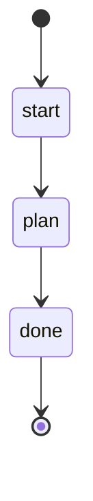

## Parameters

- plan_filename: The path to the specific plan file to process

## States

## Actions

- start: log "Making the plan for {{ plan_filename }}"
- plan: execute prompt "plan" with plan_filename="{{ plan_filename }}"
- done: log "Plan ready, look in ./issues"

## Description

This workflow creates a step-by-step plan from a specific specification file.
