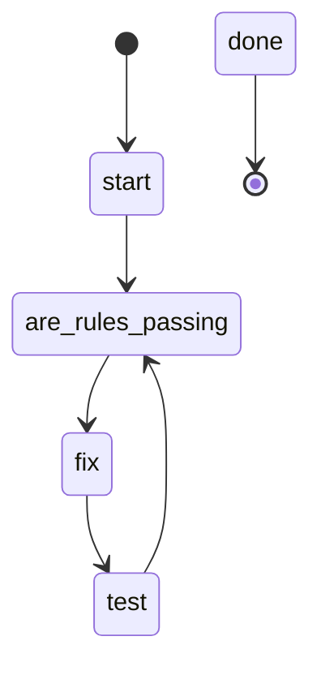

## States

## Actions

- start: log "Running code review with rules"
- are_rules_passing: execute prompt "are_rules_passing"
- fix: run workflow "do"
- test: run workflow "test"
- done: log "Code review complete"

## Description

This workflow implements a continuous code review loop, running rules checks on changed files and making fixes until all rule violations are resolved.

### Rules Passing Criteria

Rules are considered passing when:
- No ERROR severity violations found
- No WARNING severity violations found
- All changed files conform to coding standards
- Clean rules output without violations

The workflow uses the `are_rules_passing` prompt to check rule status by:
1. Running the rules tool on changed files with `changed: true` parameter
2. Creating todo items for each rule violation found
3. Returning "NO" if violations exist, "YES" if all rules pass

The `do` workflow then:
1. Works through all todo items created for rule violations
2. Completes each todo by fixing the specific violation
3. Marks each todo complete after the fix is verified

This cycle continues until the `are_rules_passing` prompt confirms all rules pass with a "YES" response.
