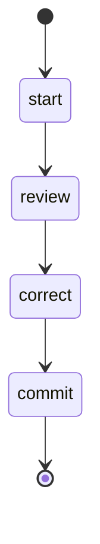

## States

## Actions

- start: log "Reviewing documentation"
- review: execute prompt "docs/review"
- correct: execute prompt "docs/correct"
- commit: execute prompt "commit"

## Description

This workflow reviews all the documentation.
