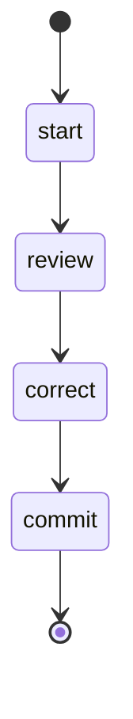

## States

## Actions

- start: log "Reviewing an issue"
- review: execute prompt "issue/review"
- correct: execute prompt "issue/code_review"
- commit: execute prompt "commit"

## Description

This workflow reviews the documentation and then implements those corrections.
