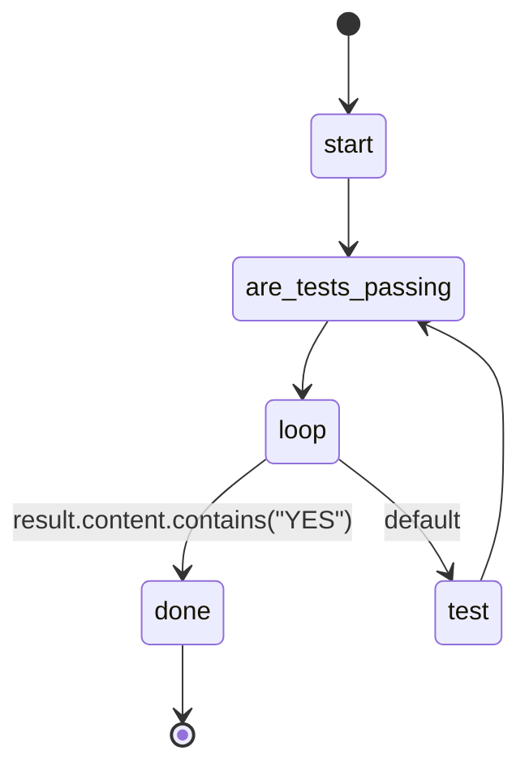

## States

## Actions

- start: log "Making tests pass"
- are_tests_passing: execute prompt "are_tests_passing"
- test: execute prompt "test"

## Description

This workflow works on tests until they all pass.
