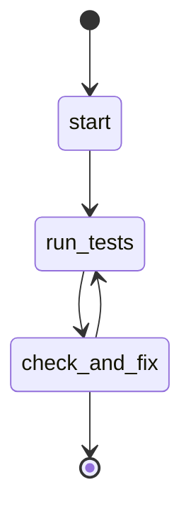

## States

## Actions

- start: log "Starting test workflow"
- run_tests: prompt "use the test skill"
- check_and_fix: prompt "Check the kanban board for cards tagged test-failure using `kanban` with `op: 'list tasks'`, `tag: 'test-failure'`, `column: 'todo'`. If there are test-failure cards remaining in the todo column, implement them: for each card, use `kanban` with `op: 'next task'`, `tag: 'test-failure'` to pick it up, move it to doing, fix the underlying issue, then complete the card. Repeat until all test-failure cards in todo are done. If there are NO test-failure cards in the todo column, exit this workflow by calling `flow` with `op: 'exit'`."

## Description

This workflow implements a test-fix loop that runs until all tests pass:

1. **Run Tests** - Executes the test skill, which runs the test suite and creates kanban cards tagged `test-failure` for any failures
2. **Check and Fix** - An inline prompt that inspects the kanban board for `test-failure` cards. If failures exist, it implements fixes for each one. If the board is clean, it calls `flow` with `op: "exit"` to terminate the workflow.

The loop continues (check_and_fix transitions back to run_tests) until the inline prompt decides to exit. No explicit JS variables or branching conditions are needed -- the AI evaluates the exit condition naturally by checking the kanban board state.
