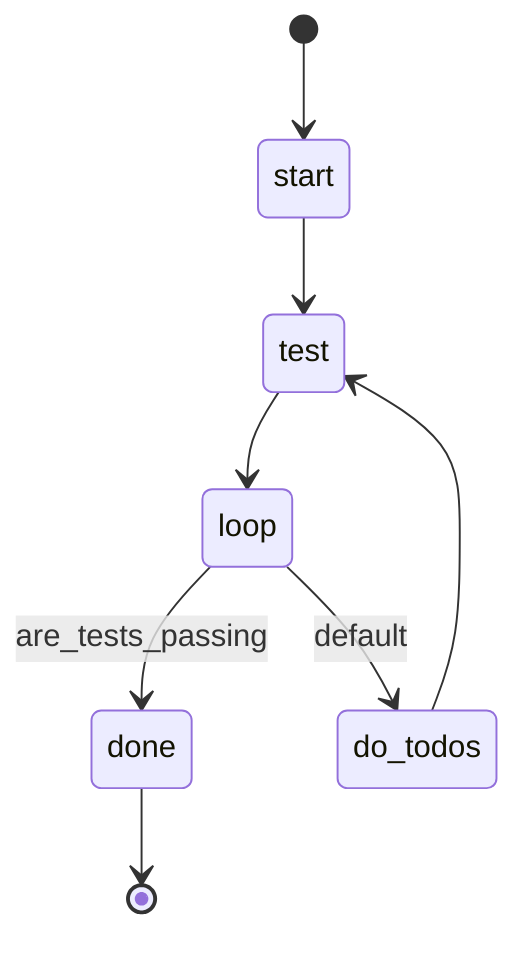

## States

## Actions

- start: shell "echo 'Making all tests pass...'"
- test: execute prompt "test"
- do_todos: run workflow "do"
- loop: log "Checking test results"
- done: log "All tests passing!"

## Initialization

Before running the workflow, ensure `are_tests_passing` is initialized in JS context

## Description

This workflow implements a Test-Driven Development (TDD) loop, continuously running tests and making fixes until all tests pass successfully.

### Test Passing Criteria

Tests are considered passing when:
- Exit code is 0 (success status)
- No test failures reported in output
- No compilation errors
- No test timeouts or panics
- Clean test output without unexpected errors or warnings

The workflow uses the `are_tests_passing` prompt to check test status by:
1. Running the test suite (e.g., `cargo nextest run`)
2. Analyzing exit codes and test output
3. Identifying failing tests and error messages
4. Determining root causes of failures

The `test` prompt then:
1. Analyzes the specific test failures
2. Identifies the code changes needed to fix failures
3. Implements fixes following TDD principles
4. Verifies the fix resolves the issue

This cycle continues until the `are_tests_passing` prompt confirms all tests pass with a "YES" response.
