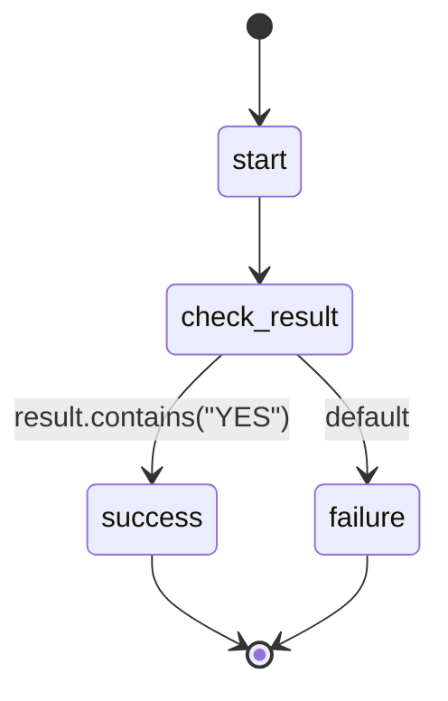

## States

## Actions

- start: log "Testing CEL evaluation"
- check_result: log "Result is YES"
- success: log "CEL worked - found YES"
- failure: log "CEL failed - did not find YES"

## Description

This workflow tests if CEL expressions work properly.