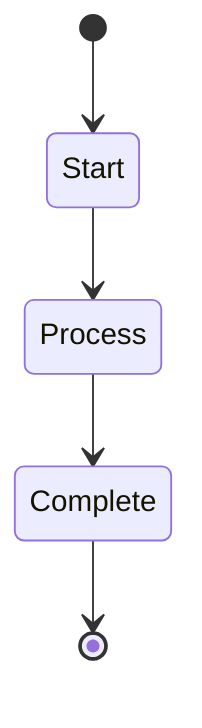
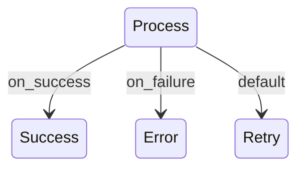

# Creating Workflows

Workflows are state machines defined in markdown that orchestrate prompts and tools to accomplish complex tasks. They support conditional branching, parallel execution, and error handling.

## Basic Structure

Every workflow requires:

1. **YAML front matter** with metadata
2. **Mermaid state diagram** for visualization
3. **Actions section** mapping states to actions

```markdown
---
name: workflow-name
title: Human Readable Title
description: What this workflow accomplishes
arguments:
  - name: param1
    description: Parameter description
    default: default_value
---

# Workflow Title

Brief description of what the workflow does.



## Actions

- Start: Log "Starting workflow"
- Process: Execute prompt "my-prompt" with param="${param1}"
- Complete: Log "Workflow finished"
```

## State Types

### Simple States
Execute one action and transition:
```yaml
- StateName: Log "Processing data"
- StateName: Execute prompt "analyze" with data="${input}"
```

### Choice States  
Branch based on conditions:
```yaml
- CheckStatus: Set status_var="${previous_result}"
```
With transitions:
```
CheckStatus --> Success: success == true
CheckStatus --> Failure: is_error == true
CheckStatus --> Retry: default
```

## Action Types

### Execute Prompt
```yaml
- MyState: Execute prompt "prompt-name" with arg1="value" result="output_var"
```

### Logging
```yaml
- LogInfo: Log "Information message"
- LogWarning: Log warning "Warning message" 
- LogError: Log error "Error occurred"
```

### Variable Management
```yaml
- SetVar: Set variable_name="value"
- SetFromResult: Set status="${previous_action_result}"
```

### Wait Operations
```yaml
- WaitShort: Wait 5 seconds
- WaitInput: Wait for user input
```

### Sub-workflows
```yaml
- Delegate: Run workflow "sub-workflow-name"
```

## Conditional Transitions

### Success/Failure Branching


### CEL Expressions
```yaml
# In the actions section, transitions are defined separately
MyState --> Branch1: variable.contains("success")
MyState --> Branch2: is_error == true
MyState --> Default: default
```

## Variable System

### Built-in Variables
- `result` - Output from the last action
- `success` - Boolean indicating success
- `failure` - Boolean indicating failure  
- `is_error` - Error state from Claude API
- `duration_ms` - Execution time

### Custom Variables
Set with actions:
```yaml
- SetContext: Set project_name="MyProject"
```

Use in templates:
```yaml
- LogStatus: Log "Processing ${project_name}"
```

## Testing Workflows

### Command Line Testing
```bash
# Run workflow
sah flow run my-workflow

# Test without execution
sah flow test my-workflow

# Run with parameters
sah flow run my-workflow --param1 "value"

# Check status
sah flow status my-workflow-run-id
```

### Validation
```bash
# Validate syntax
sah validate workflows/

# Visualize state diagram  
sah flow visualize my-workflow
```

## Best Practices

- **Keep states focused** - One clear action per state
- **Use descriptive names** - Clear state and variable names
- **Handle errors** - Include failure paths in state diagrams
- **Test incrementally** - Build and test workflows step by step
- **Document flow** - Explain complex branching logic
- **Use sub-workflows** - Break complex flows into reusable components