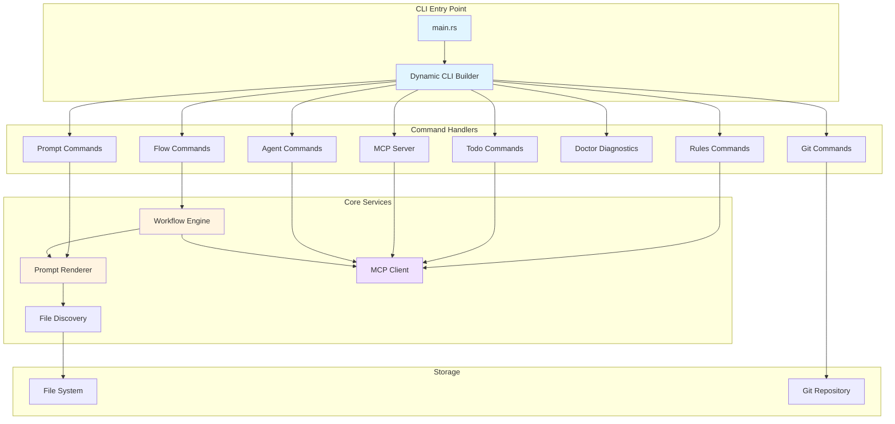
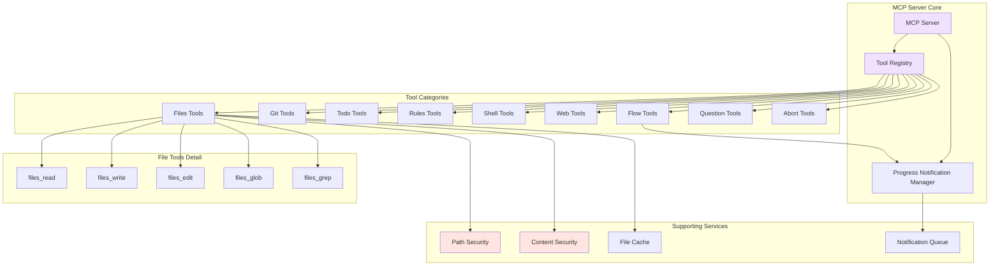
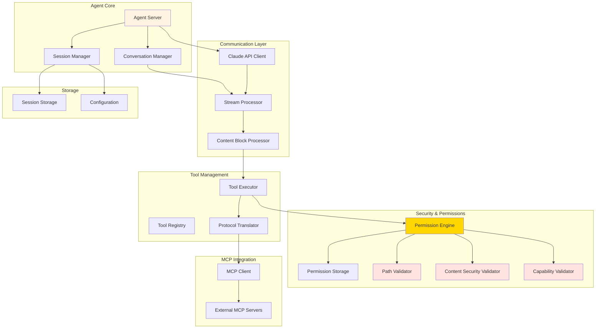
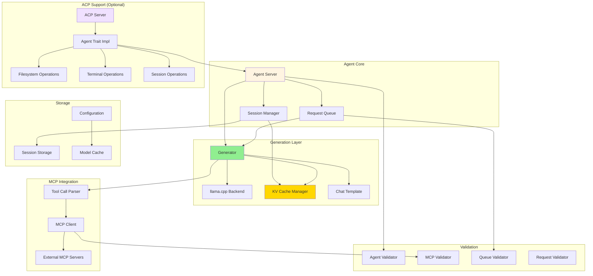
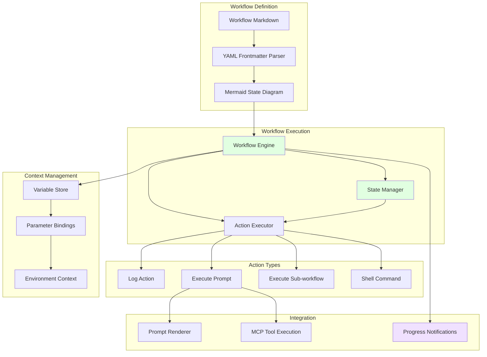
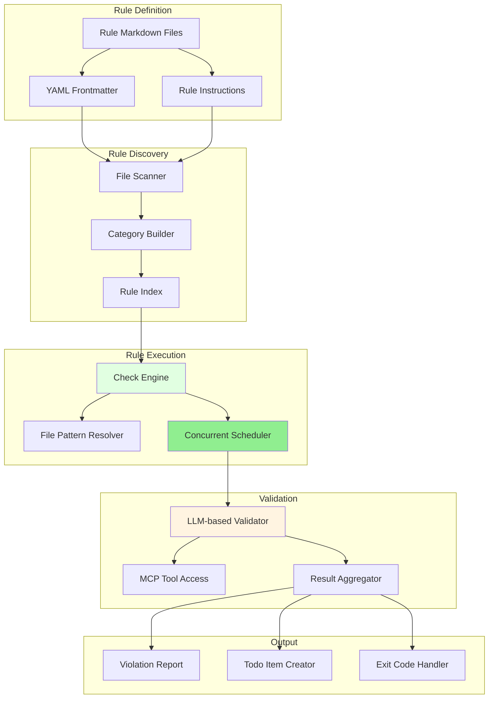
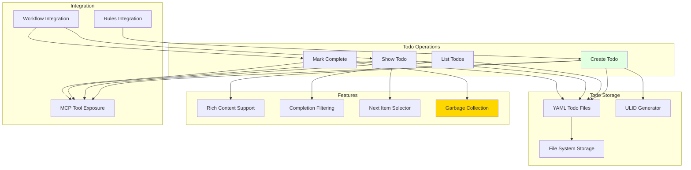

# Component Details

This page provides detailed architecture diagrams for each major component in the SwissArmyHammer system.

## CLI Application Architecture

### CLI Features

- **Dynamic Command Generation**: Commands are generated at runtime from discovered workflows
- **Comprehensive Help System**: Auto-generated help text from workflow metadata
- **Shell Completions**: Bash, Zsh, Fish, and PowerShell support
- **Interactive Mode**: Prompt for missing required parameters
- **Dry Run**: Preview workflow execution without making changes

## MCP Server Architecture

### Tool Organization

**File Operations**
- `files_read`: Read file contents with offset/limit support
- `files_write`: Write complete file contents atomically
- `files_edit`: Precise string replacements
- `files_glob`: Pattern matching with .gitignore support
- `files_grep`: Content search with ripgrep

**Git Operations**
- `git_changes`: List changed files on a branch
- Git integration with automatic parent branch detection

**Task Management**
- `todo_create`: Create new todo items
- `todo_list`: List todos with filtering
- `todo_show`: Get specific or next todo
- `todo_mark_complete`: Complete todo items

**Code Quality**
- `rules_create`: Create validation rules
- `rules_check`: Check code against rules

**Workflow Execution**
- `flow`: Execute workflows with progress notifications

**Web Integration**
- `web_search`: DuckDuckGo search with content fetching
- `web_fetch`: HTML to markdown conversion

**Shell Operations**
- `shell_execute`: Safe command execution with output capture

**Question Management**
- `question_ask`: Interactive user questions via elicitation
- `question_summary`: Retrieve Q&A history

**Emergency Controls**
- `abort_create`: Signal workflow termination

## Claude Agent Architecture

### Claude Agent Features

**Streaming Conversation Management**
- Real-time token streaming from Claude API
- Content block processing for text and tool calls
- Conversation history persistence
- Automatic session compaction

**Tool Orchestration**
- MCP tool integration
- Protocol translation between Claude and MCP formats
- Tool result formatting and error handling
- Concurrent tool execution support

**Permission Management**
- Three-tier permission system (AlwaysAsk, AutoApproveReads, RuleBased)
- Path security validation
- Content security validation
- Capability-based restrictions
- Persistent permission storage

**Session Management**
- ULID-based session identification
- Automatic session persistence
- Session loading with history replay
- Configuration-based session limits

## LLaMA Agent Architecture

### LLaMA Agent Features

**Local Inference**
- Integration with llama.cpp for local model execution
- KV cache optimization for session continuity
- Template cache for fast context switching
- Streaming token generation

**Session Compaction**
- Automatic compaction at configurable thresholds
- Preservation of critical conversation context
- KV cache state management across compaction
- Session persistence to disk

**MCP Client**
- Connect to external MCP servers over stdio and HTTP
- Tool call parsing from LLaMA output
- Result formatting and error recovery
- Multiple simultaneous server connections

**ACP Integration (Optional)**
- JSON-RPC 2.0 server over stdio
- Streaming token notifications
- Permission-based file operations
- Terminal execution support
- Session loading and persistence
- Slash command integration
- Mode switching (Code, Plan, Test)

## Workflow Engine Architecture

### Workflow Features

**State Machine Execution**
- Mermaid diagram parsing for state definitions
- Automatic state transition logic
- Error state handling
- Completion detection

**Action Types**
- **Log**: Output messages to console
- **Execute Prompt**: Render and execute prompts with context
- **Execute Sub-workflow**: Nested workflow execution
- **Shell Command**: Safe command execution

**Context Management**
- Parameter binding from CLI arguments
- Variable interpolation in actions
- Environment variable access
- State-based context passing

**Progress Notifications**
- MCP notification support for long-running workflows
- Progress tracking across states
- Cancellation support

## Rules Engine Architecture

### Rules Features

**Rule Organization**
- Markdown-based rule definitions
- Category-based organization via directory structure
- Severity levels: error, warning, info, hint
- Tag-based filtering

**Flexible Checking**
- File pattern matching (glob support)
- Git integration for changed files only
- Specific rule selection
- Category and severity filtering

**Concurrent Execution**
- Configurable concurrency limits
- Parallel rule checking across files
- Result aggregation
- Early termination on max errors

**Integration**
- Automatic todo creation for violations
- LLM-based validation via MCP tools
- Exit code based on severity
- Rich violation reporting

## Todo System Architecture

### Todo Features

**Simple Structure**
- ULID-based unique identification
- Task description with optional context
- Boolean completion status
- YAML file storage

**Operations**
- Create with task and context
- List with completion filtering
- Show specific item or next incomplete
- Mark complete with automatic GC

**Integration Points**
- MCP tool exposure for AI agents
- Rules engine violation tracking
- Workflow task management
- Automatic cleanup on completion

## Next Steps

- [Data Flow Diagrams](dataflow.md) - Detailed interaction sequences
- [Security Architecture](../03-security/overview.md) - Security model details
- [MCP Protocol](mcp-protocol.md) - MCP implementation details
- [ACP Protocol](acp-protocol.md) - ACP implementation details
