# Data Flow Diagrams

Detailed sequence diagrams showing how data flows through SwissArmyHammer components.

## Prompt Execution Flow

### Basic Prompt Rendering

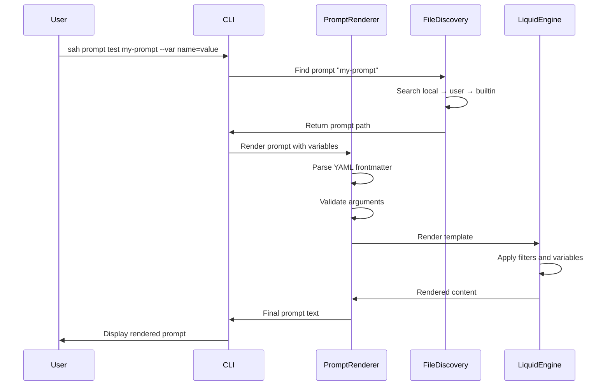
```mermaid
sequenceDiagram
    participant User
    participant CLI
    participant PromptRenderer
    participant FileDiscovery
    participant LiquidEngine
    
    User->>CLI: sah prompt test my-prompt --var name=value
    CLI->>FileDiscovery: Find prompt "my-prompt"
    FileDiscovery->>FileDiscovery: Search local → user → builtin
    FileDiscovery->>CLI: Return prompt path
    
    CLI->>PromptRenderer: Render prompt with variables
    PromptRenderer->>PromptRenderer: Parse YAML frontmatter
    PromptRenderer->>PromptRenderer: Validate arguments
    PromptRenderer->>LiquidEngine: Render template
    LiquidEngine->>LiquidEngine: Apply filters and variables
    LiquidEngine->>PromptRenderer: Rendered content
    
    PromptRenderer->>CLI: Final prompt text
    CLI->>User: Display rendered prompt
```

### Prompt Execution with Agent

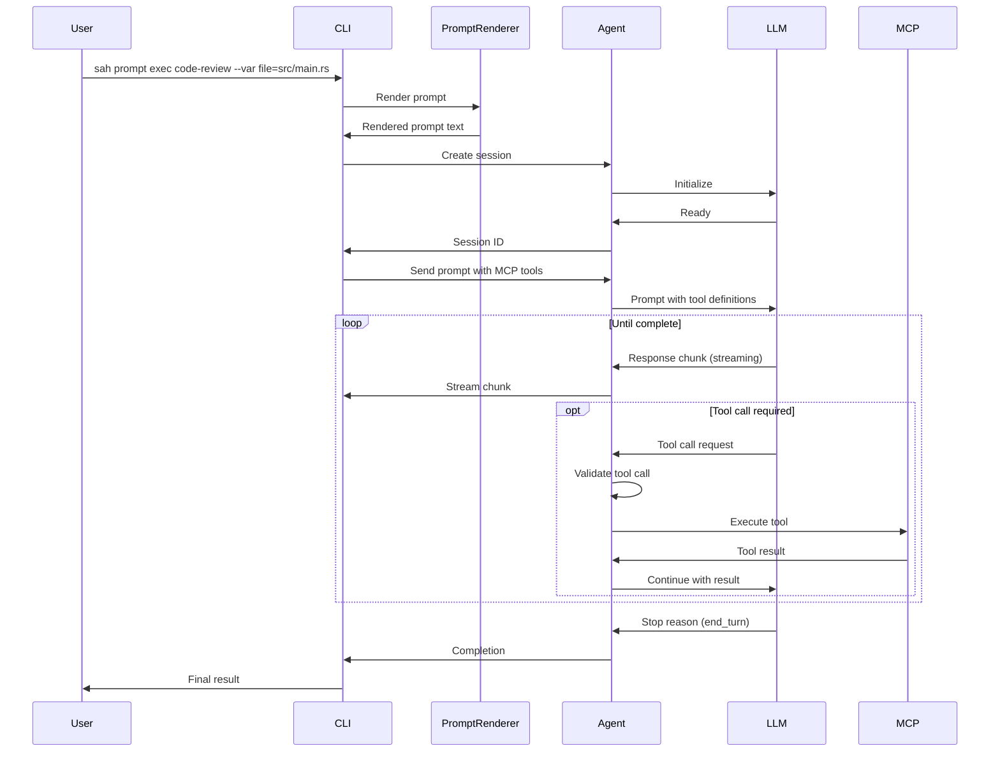
```mermaid
sequenceDiagram
    participant User
    participant CLI
    participant PromptRenderer
    participant Agent
    participant LLM
    participant MCP
    
    User->>CLI: sah prompt exec code-review --var file=src/main.rs
    CLI->>PromptRenderer: Render prompt
    PromptRenderer->>CLI: Rendered prompt text
    
    CLI->>Agent: Create session
    Agent->>LLM: Initialize
    LLM->>Agent: Ready
    Agent->>CLI: Session ID
    
    CLI->>Agent: Send prompt with MCP tools
    Agent->>LLM: Prompt with tool definitions
    
    loop Until complete
        LLM->>Agent: Response chunk (streaming)
        Agent->>CLI: Stream chunk
        
        opt Tool call required
            LLM->>Agent: Tool call request
            Agent->>Agent: Validate tool call
            Agent->>MCP: Execute tool
            MCP->>Agent: Tool result
            Agent->>LLM: Continue with result
        end
    end
    
    LLM->>Agent: Stop reason (end_turn)
    Agent->>CLI: Completion
    CLI->>User: Final result
```

## Workflow Execution Flow

### Complete Workflow Execution

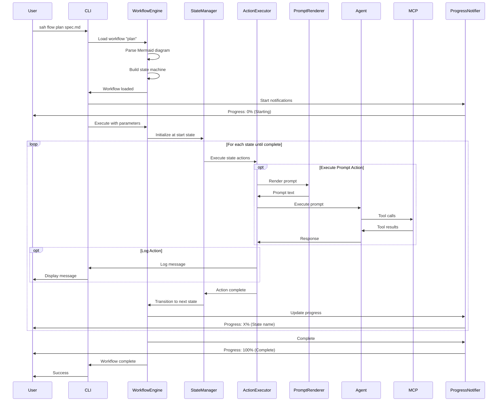
```mermaid
sequenceDiagram
    participant User
    participant CLI
    participant WorkflowEngine
    participant StateManager
    participant ActionExecutor
    participant PromptRenderer
    participant Agent
    participant MCP
    participant ProgressNotifier
    
    User->>CLI: sah flow plan spec.md
    CLI->>WorkflowEngine: Load workflow "plan"
    WorkflowEngine->>WorkflowEngine: Parse Mermaid diagram
    WorkflowEngine->>WorkflowEngine: Build state machine
    WorkflowEngine->>CLI: Workflow loaded
    
    CLI->>ProgressNotifier: Start notifications
    ProgressNotifier->>User: Progress: 0% (Starting)
    
    CLI->>WorkflowEngine: Execute with parameters
    WorkflowEngine->>StateManager: Initialize at start state
    
    loop For each state until complete
        StateManager->>ActionExecutor: Execute state actions
        
        opt Execute Prompt Action
            ActionExecutor->>PromptRenderer: Render prompt
            PromptRenderer->>ActionExecutor: Prompt text
            ActionExecutor->>Agent: Execute prompt
            Agent->>MCP: Tool calls
            MCP->>Agent: Tool results
            Agent->>ActionExecutor: Response
        end
        
        opt Log Action
            ActionExecutor->>CLI: Log message
            CLI->>User: Display message
        end
        
        ActionExecutor->>StateManager: Action complete
        StateManager->>WorkflowEngine: Transition to next state
        WorkflowEngine->>ProgressNotifier: Update progress
        ProgressNotifier->>User: Progress: X% (State name)
    end
    
    WorkflowEngine->>ProgressNotifier: Complete
    ProgressNotifier->>User: Progress: 100% (Complete)
    WorkflowEngine->>CLI: Workflow complete
    CLI->>User: Success
```

### Workflow with Nested Sub-workflows

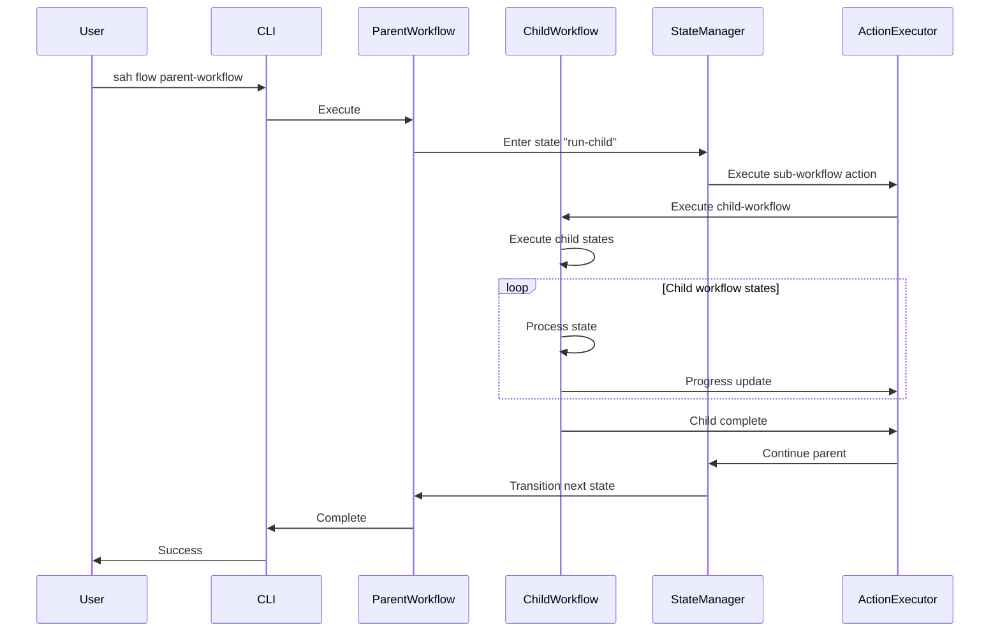
```mermaid
sequenceDiagram
    participant User
    participant CLI
    participant ParentWorkflow
    participant ChildWorkflow
    participant StateManager
    participant ActionExecutor
    
    User->>CLI: sah flow parent-workflow
    CLI->>ParentWorkflow: Execute
    ParentWorkflow->>StateManager: Enter state "run-child"
    StateManager->>ActionExecutor: Execute sub-workflow action
    
    ActionExecutor->>ChildWorkflow: Execute child-workflow
    ChildWorkflow->>ChildWorkflow: Execute child states
    
    loop Child workflow states
        ChildWorkflow->>ChildWorkflow: Process state
        ChildWorkflow->>ActionExecutor: Progress update
    end
    
    ChildWorkflow->>ActionExecutor: Child complete
    ActionExecutor->>StateManager: Continue parent
    StateManager->>ParentWorkflow: Transition next state
    ParentWorkflow->>CLI: Complete
    CLI->>User: Success
```

## MCP Tool Execution Flow

### Simple Tool Call

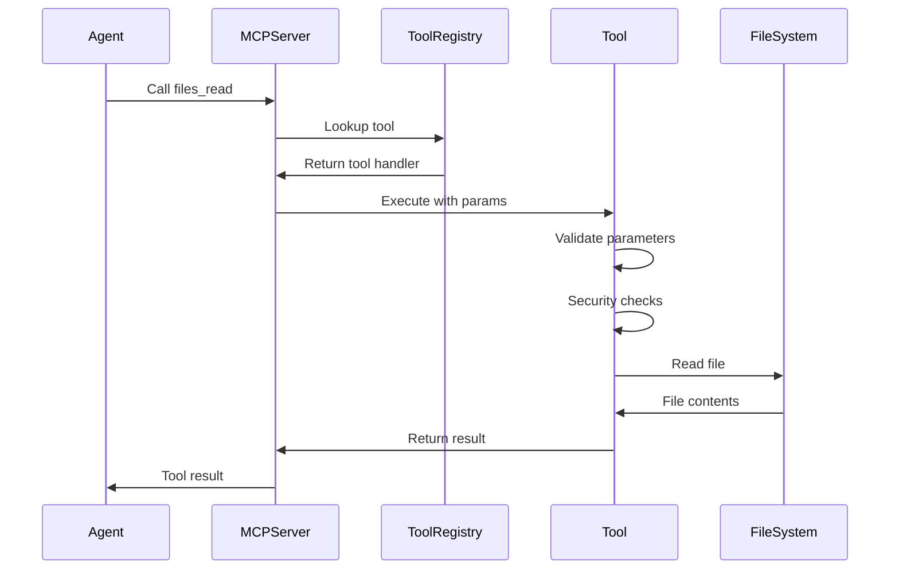
```mermaid
sequenceDiagram
    participant Agent
    participant MCPServer
    participant ToolRegistry
    participant Tool
    participant FileSystem
    
    Agent->>MCPServer: Call files_read
    MCPServer->>ToolRegistry: Lookup tool
    ToolRegistry->>MCPServer: Return tool handler
    
    MCPServer->>Tool: Execute with params
    Tool->>Tool: Validate parameters
    Tool->>Tool: Security checks
    Tool->>FileSystem: Read file
    FileSystem->>Tool: File contents
    Tool->>MCPServer: Return result
    
    MCPServer->>Agent: Tool result
```

### Tool Call with Progress Notifications

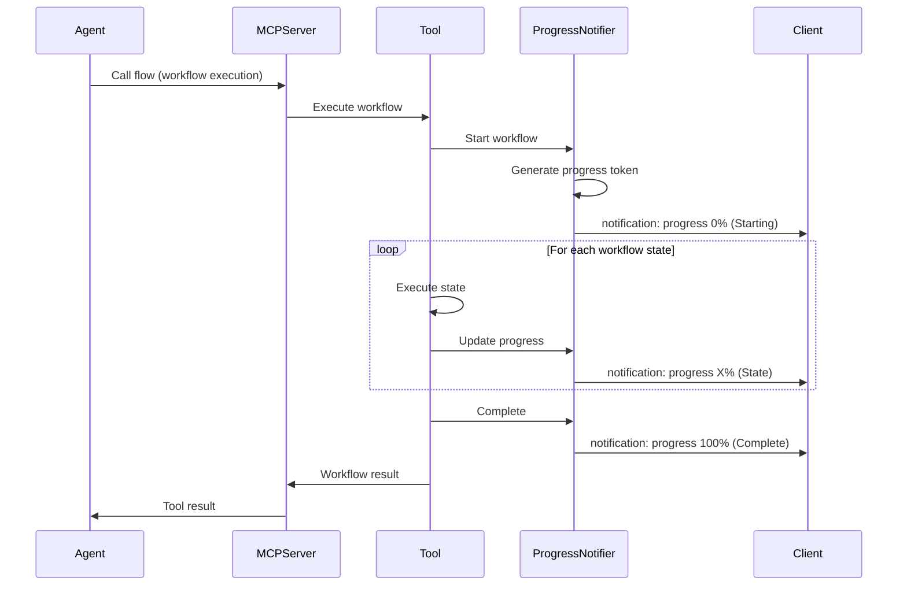
```mermaid
sequenceDiagram
    participant Agent
    participant MCPServer
    participant Tool
    participant ProgressNotifier
    participant Client
    
    Agent->>MCPServer: Call flow (workflow execution)
    MCPServer->>Tool: Execute workflow
    
    Tool->>ProgressNotifier: Start workflow
    ProgressNotifier->>ProgressNotifier: Generate progress token
    ProgressNotifier->>Client: notification: progress 0% (Starting)
    
    loop For each workflow state
        Tool->>Tool: Execute state
        Tool->>ProgressNotifier: Update progress
        ProgressNotifier->>Client: notification: progress X% (State)
    end
    
    Tool->>ProgressNotifier: Complete
    ProgressNotifier->>Client: notification: progress 100% (Complete)
    
    Tool->>MCPServer: Workflow result
    MCPServer->>Agent: Tool result
```

### Tool Call with Permission Request

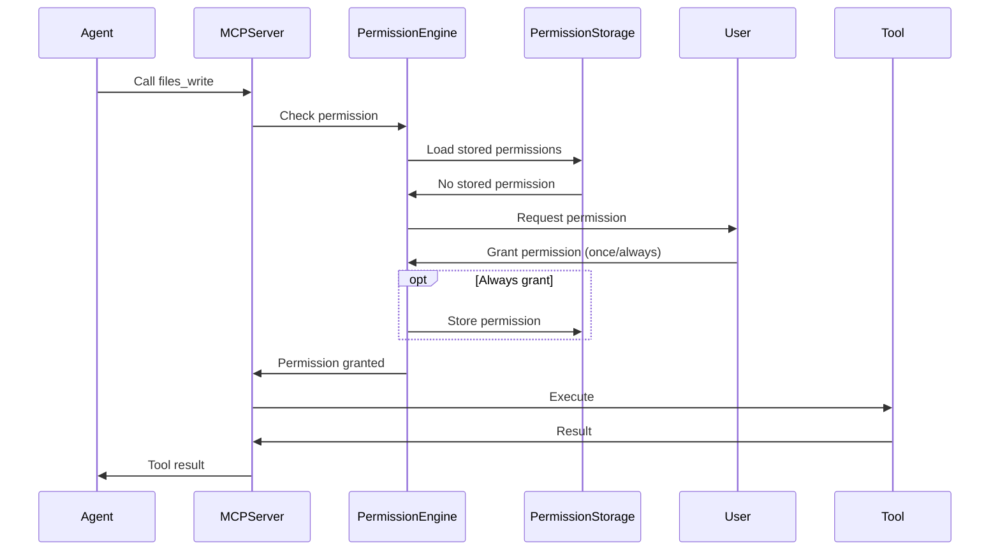
```mermaid
sequenceDiagram
    participant Agent
    participant MCPServer
    participant PermissionEngine
    participant PermissionStorage
    participant User
    participant Tool
    
    Agent->>MCPServer: Call files_write
    MCPServer->>PermissionEngine: Check permission
    
    PermissionEngine->>PermissionStorage: Load stored permissions
    PermissionStorage->>PermissionEngine: No stored permission
    
    PermissionEngine->>User: Request permission
    User->>PermissionEngine: Grant permission (once/always)
    
    opt Always grant
        PermissionEngine->>PermissionStorage: Store permission
    end
    
    PermissionEngine->>MCPServer: Permission granted
    MCPServer->>Tool: Execute
    Tool->>MCPServer: Result
    MCPServer->>Agent: Tool result
```

## Editor Integration Flow (ACP)

### Session Initialization

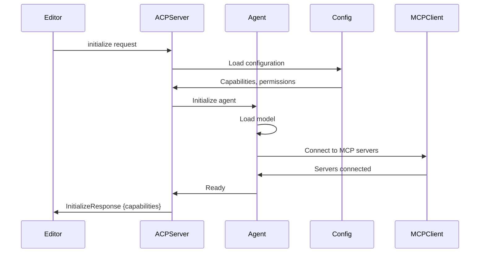
```mermaid
sequenceDiagram
    participant Editor
    participant ACPServer
    participant Agent
    participant Config
    participant MCPClient
    
    Editor->>ACPServer: initialize request
    ACPServer->>Config: Load configuration
    Config->>ACPServer: Capabilities, permissions
    
    ACPServer->>Agent: Initialize agent
    Agent->>Agent: Load model
    Agent->>MCPClient: Connect to MCP servers
    MCPClient->>Agent: Servers connected
    Agent->>ACPServer: Ready
    
    ACPServer->>Editor: InitializeResponse {capabilities}
```

### Streaming Conversation

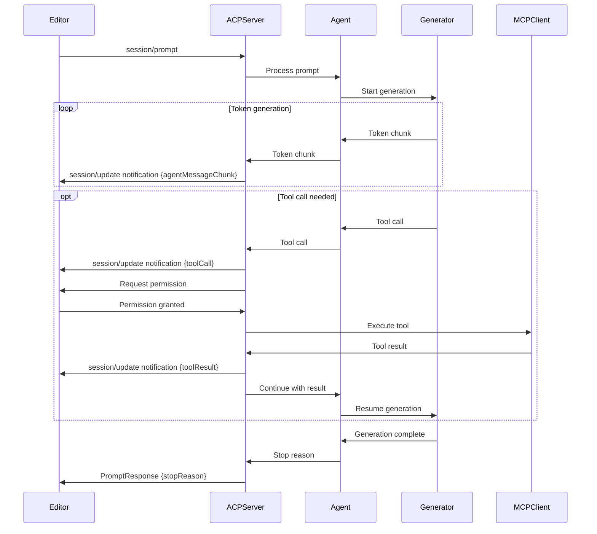
```mermaid
sequenceDiagram
    participant Editor
    participant ACPServer
    participant Agent
    participant Generator
    participant MCPClient
    
    Editor->>ACPServer: session/prompt
    ACPServer->>Agent: Process prompt
    Agent->>Generator: Start generation
    
    loop Token generation
        Generator->>Agent: Token chunk
        Agent->>ACPServer: Token chunk
        ACPServer->>Editor: session/update notification {agentMessageChunk}
    end
    
    opt Tool call needed
        Generator->>Agent: Tool call
        Agent->>ACPServer: Tool call
        ACPServer->>Editor: session/update notification {toolCall}
        ACPServer->>Editor: Request permission
        Editor->>ACPServer: Permission granted
        
        ACPServer->>MCPClient: Execute tool
        MCPClient->>ACPServer: Tool result
        ACPServer->>Editor: session/update notification {toolResult}
        
        ACPServer->>Agent: Continue with result
        Agent->>Generator: Resume generation
    end
    
    Generator->>Agent: Generation complete
    Agent->>ACPServer: Stop reason
    ACPServer->>Editor: PromptResponse {stopReason}
```

### Session Loading

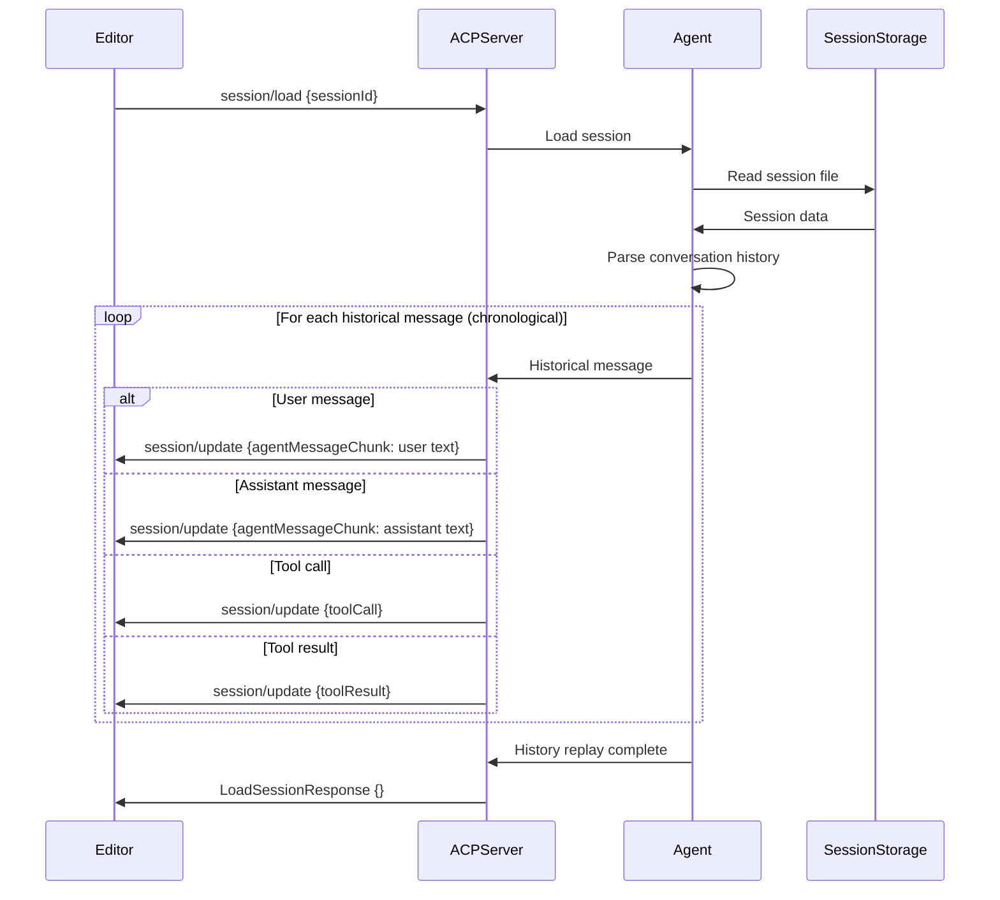
```mermaid
sequenceDiagram
    participant Editor
    participant ACPServer
    participant Agent
    participant SessionStorage
    
    Editor->>ACPServer: session/load {sessionId}
    ACPServer->>Agent: Load session
    Agent->>SessionStorage: Read session file
    SessionStorage->>Agent: Session data
    
    Agent->>Agent: Parse conversation history
    
    loop For each historical message (chronological)
        Agent->>ACPServer: Historical message
        
        alt User message
            ACPServer->>Editor: session/update {agentMessageChunk: user text}
        else Assistant message
            ACPServer->>Editor: session/update {agentMessageChunk: assistant text}
        else Tool call
            ACPServer->>Editor: session/update {toolCall}
        else Tool result
            ACPServer->>Editor: session/update {toolResult}
        end
    end
    
    Agent->>ACPServer: History replay complete
    ACPServer->>Editor: LoadSessionResponse {}
```

### File Operations with Permission

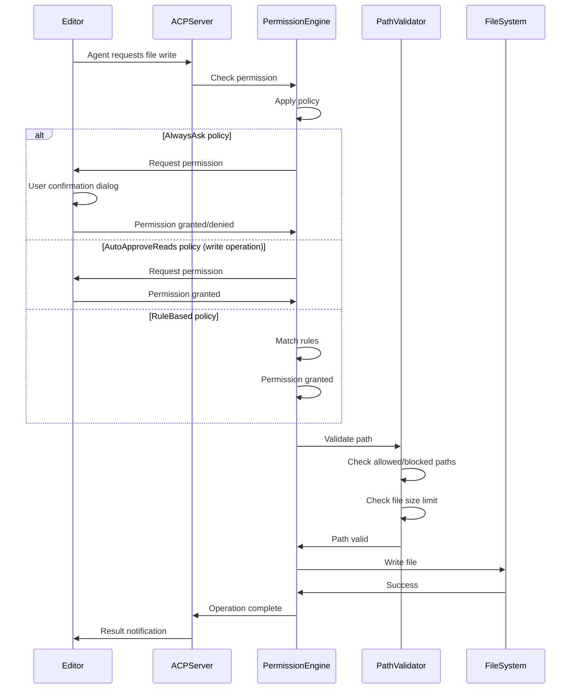
```mermaid
sequenceDiagram
    participant Editor
    participant ACPServer
    participant PermissionEngine
    participant PathValidator
    participant FileSystem
    
    Editor->>ACPServer: Agent requests file write
    ACPServer->>PermissionEngine: Check permission
    
    PermissionEngine->>PermissionEngine: Apply policy
    
    alt AlwaysAsk policy
        PermissionEngine->>Editor: Request permission
        Editor->>Editor: User confirmation dialog
        Editor->>PermissionEngine: Permission granted/denied
    else AutoApproveReads policy (write operation)
        PermissionEngine->>Editor: Request permission
        Editor->>PermissionEngine: Permission granted
    else RuleBased policy
        PermissionEngine->>PermissionEngine: Match rules
        PermissionEngine->>PermissionEngine: Permission granted
    end
    
    PermissionEngine->>PathValidator: Validate path
    PathValidator->>PathValidator: Check allowed/blocked paths
    PathValidator->>PathValidator: Check file size limit
    PathValidator->>PermissionEngine: Path valid
    
    PermissionEngine->>FileSystem: Write file
    FileSystem->>PermissionEngine: Success
    PermissionEngine->>ACPServer: Operation complete
    ACPServer->>Editor: Result notification
```

### Terminal Execution

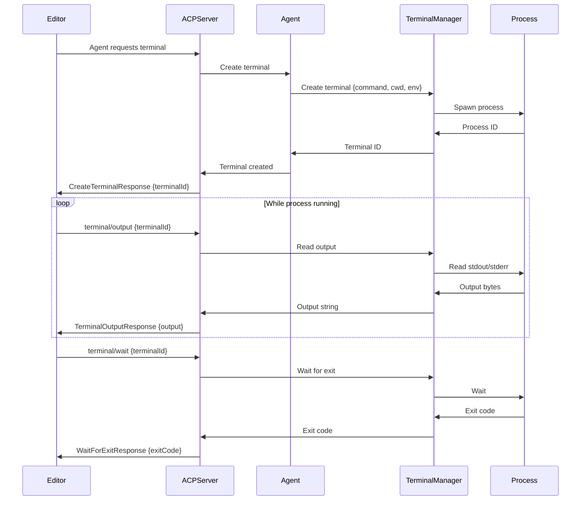
```mermaid
sequenceDiagram
    participant Editor
    participant ACPServer
    participant Agent
    participant TerminalManager
    participant Process
    
    Editor->>ACPServer: Agent requests terminal
    ACPServer->>Agent: Create terminal
    Agent->>TerminalManager: Create terminal {command, cwd, env}
    
    TerminalManager->>Process: Spawn process
    Process->>TerminalManager: Process ID
    TerminalManager->>Agent: Terminal ID
    Agent->>ACPServer: Terminal created
    ACPServer->>Editor: CreateTerminalResponse {terminalId}
    
    loop While process running
        Editor->>ACPServer: terminal/output {terminalId}
        ACPServer->>TerminalManager: Read output
        TerminalManager->>Process: Read stdout/stderr
        Process->>TerminalManager: Output bytes
        TerminalManager->>ACPServer: Output string
        ACPServer->>Editor: TerminalOutputResponse {output}
    end
    
    Editor->>ACPServer: terminal/wait {terminalId}
    ACPServer->>TerminalManager: Wait for exit
    TerminalManager->>Process: Wait
    Process->>TerminalManager: Exit code
    TerminalManager->>ACPServer: Exit code
    ACPServer->>Editor: WaitForExitResponse {exitCode}
```

## Rules Checking Flow

### Concurrent Rule Checking

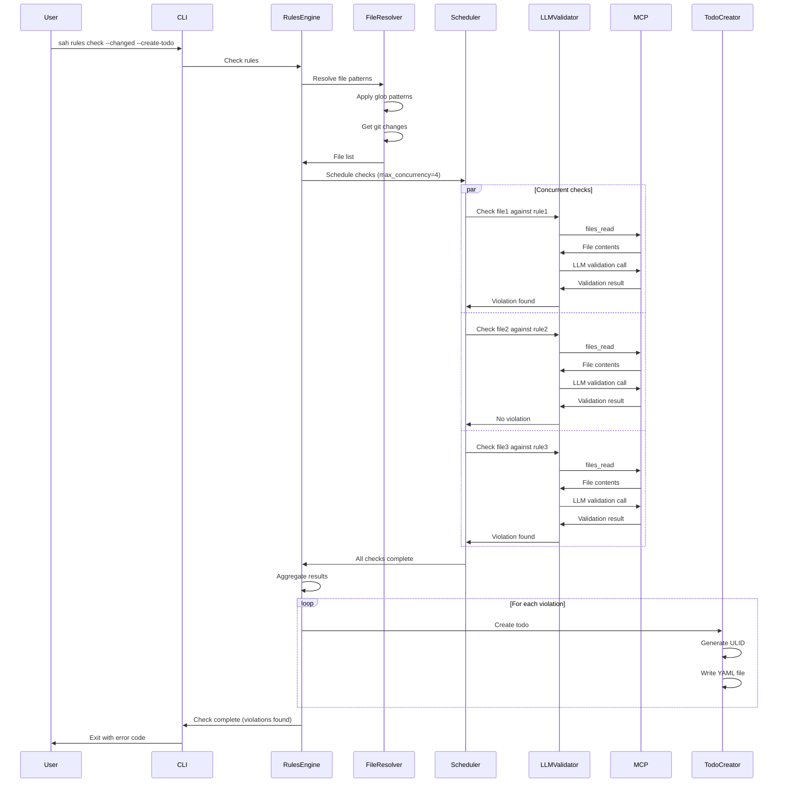
```mermaid
sequenceDiagram
    participant User
    participant CLI
    participant RulesEngine
    participant FileResolver
    participant Scheduler
    participant LLMValidator
    participant MCP
    participant TodoCreator
    
    User->>CLI: sah rules check --changed --create-todo
    CLI->>RulesEngine: Check rules
    
    RulesEngine->>FileResolver: Resolve file patterns
    FileResolver->>FileResolver: Apply glob patterns
    FileResolver->>FileResolver: Get git changes
    FileResolver->>RulesEngine: File list
    
    RulesEngine->>Scheduler: Schedule checks (max_concurrency=4)
    
    par Concurrent checks
        Scheduler->>LLMValidator: Check file1 against rule1
        LLMValidator->>MCP: files_read
        MCP->>LLMValidator: File contents
        LLMValidator->>MCP: LLM validation call
        MCP->>LLMValidator: Validation result
        LLMValidator->>Scheduler: Violation found
    and
        Scheduler->>LLMValidator: Check file2 against rule2
        LLMValidator->>MCP: files_read
        MCP->>LLMValidator: File contents
        LLMValidator->>MCP: LLM validation call
        MCP->>LLMValidator: Validation result
        LLMValidator->>Scheduler: No violation
    and
        Scheduler->>LLMValidator: Check file3 against rule3
        LLMValidator->>MCP: files_read
        MCP->>LLMValidator: File contents
        LLMValidator->>MCP: LLM validation call
        MCP->>LLMValidator: Validation result
        LLMValidator->>Scheduler: Violation found
    end
    
    Scheduler->>RulesEngine: All checks complete
    RulesEngine->>RulesEngine: Aggregate results
    
    loop For each violation
        RulesEngine->>TodoCreator: Create todo
        TodoCreator->>TodoCreator: Generate ULID
        TodoCreator->>TodoCreator: Write YAML file
    end
    
    RulesEngine->>CLI: Check complete (violations found)
    CLI->>User: Exit with error code
```

## Question Management Flow

### Interactive Question with Persistence

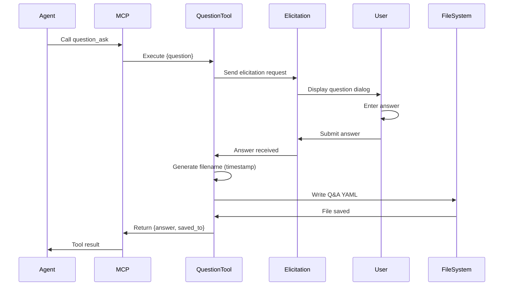
```mermaid
sequenceDiagram
    participant Agent
    participant MCP
    participant QuestionTool
    participant Elicitation
    participant User
    participant FileSystem
    
    Agent->>MCP: Call question_ask
    MCP->>QuestionTool: Execute {question}
    
    QuestionTool->>Elicitation: Send elicitation request
    Elicitation->>User: Display question dialog
    User->>User: Enter answer
    User->>Elicitation: Submit answer
    Elicitation->>QuestionTool: Answer received
    
    QuestionTool->>QuestionTool: Generate filename (timestamp)
    QuestionTool->>FileSystem: Write Q&A YAML
    FileSystem->>QuestionTool: File saved
    
    QuestionTool->>MCP: Return {answer, saved_to}
    MCP->>Agent: Tool result
```

### Retrieve Question History

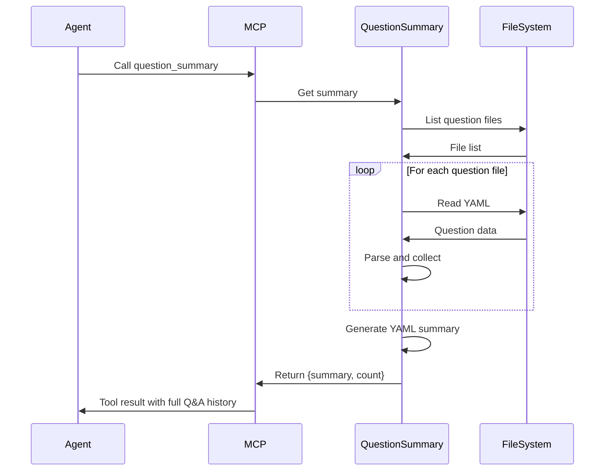
```mermaid
sequenceDiagram
    participant Agent
    participant MCP
    participant QuestionSummary
    participant FileSystem
    
    Agent->>MCP: Call question_summary
    MCP->>QuestionSummary: Get summary
    
    QuestionSummary->>FileSystem: List question files
    FileSystem->>QuestionSummary: File list
    
    loop For each question file
        QuestionSummary->>FileSystem: Read YAML
        FileSystem->>QuestionSummary: Question data
        QuestionSummary->>QuestionSummary: Parse and collect
    end
    
    QuestionSummary->>QuestionSummary: Generate YAML summary
    QuestionSummary->>MCP: Return {summary, count}
    MCP->>Agent: Tool result with full Q&A history
```

## Todo Management Flow

### Todo Lifecycle

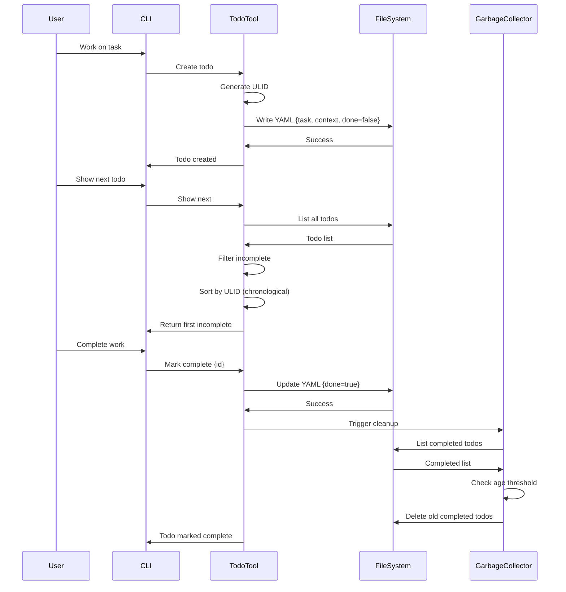
```mermaid
sequenceDiagram
    participant User
    participant CLI
    participant TodoTool
    participant FileSystem
    participant GarbageCollector
    
    User->>CLI: Work on task
    CLI->>TodoTool: Create todo
    TodoTool->>TodoTool: Generate ULID
    TodoTool->>FileSystem: Write YAML {task, context, done=false}
    FileSystem->>TodoTool: Success
    TodoTool->>CLI: Todo created
    
    User->>CLI: Show next todo
    CLI->>TodoTool: Show next
    TodoTool->>FileSystem: List all todos
    FileSystem->>TodoTool: Todo list
    TodoTool->>TodoTool: Filter incomplete
    TodoTool->>TodoTool: Sort by ULID (chronological)
    TodoTool->>CLI: Return first incomplete
    
    User->>CLI: Complete work
    CLI->>TodoTool: Mark complete {id}
    TodoTool->>FileSystem: Update YAML {done=true}
    FileSystem->>TodoTool: Success
    
    TodoTool->>GarbageCollector: Trigger cleanup
    GarbageCollector->>FileSystem: List completed todos
    FileSystem->>GarbageCollector: Completed list
    GarbageCollector->>GarbageCollector: Check age threshold
    GarbageCollector->>FileSystem: Delete old completed todos
    
    TodoTool->>CLI: Todo marked complete
```

## Next Steps

- [Architecture Overview](overview.md) - High-level system architecture
- [Component Details](components.md) - Individual component architectures
- [Security Model](../03-security/overview.md) - Security implementation details
