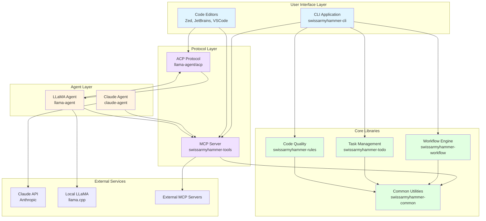
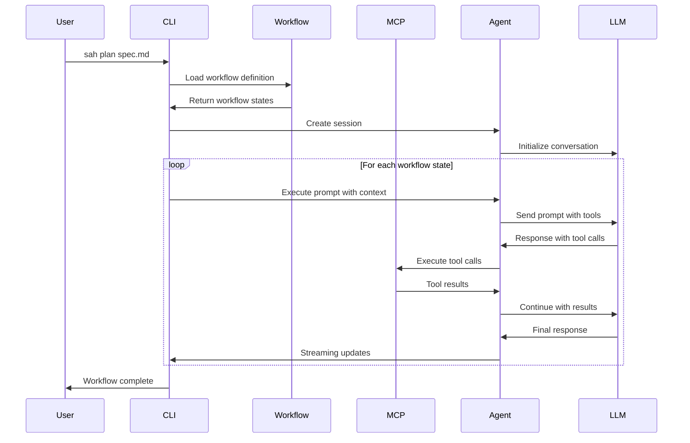
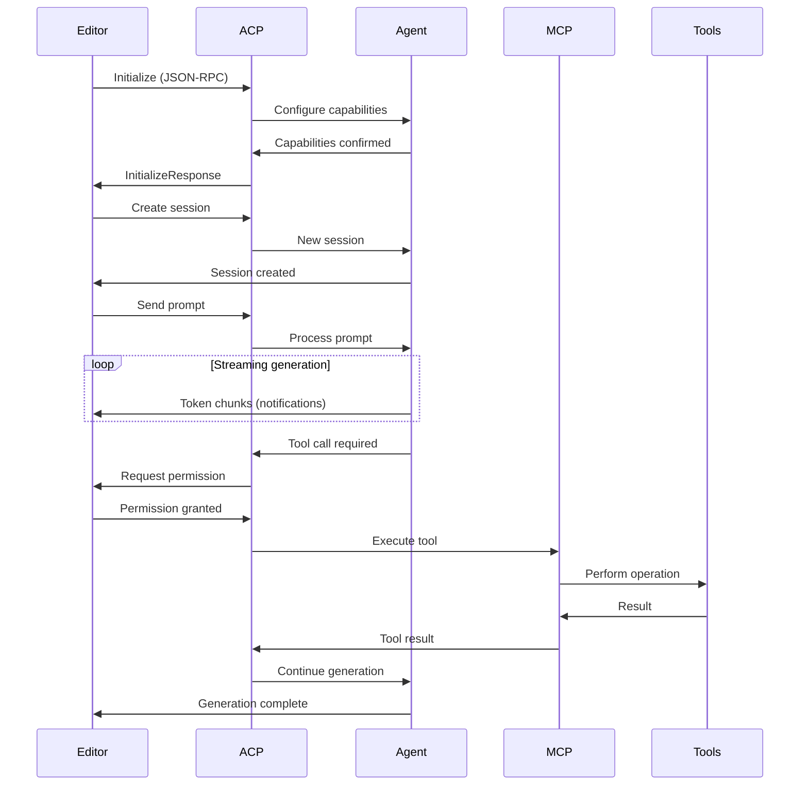
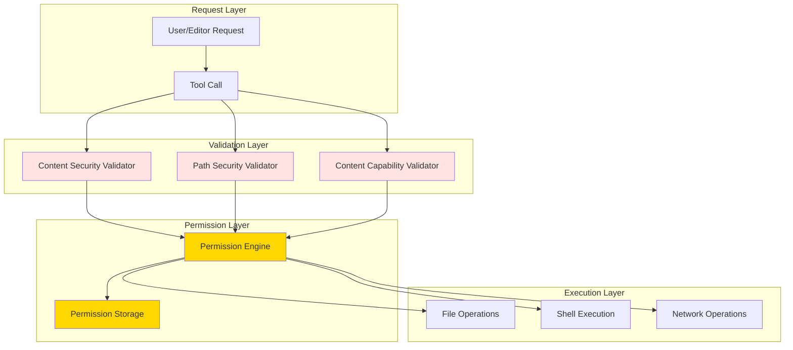

# Architecture Overview

SwissArmyHammer is designed as a modular system with three primary components that work together to provide a comprehensive AI-assisted development platform.

## System Architecture

## Component Overview

### User Interface Layer

#### CLI Application
The command-line interface provides direct access to all SwissArmyHammer features:
- Execute prompts and workflows
- Manage tasks and rules
- Run diagnostics and tests
- Interact with MCP servers

#### Code Editors
Integration with popular code editors through standardized protocols:
- **Zed Editor**: Native ACP support
- **JetBrains IDEs**: ACP plugin support
- **VSCode**: MCP extension support

### Agent Layer

#### Claude Agent
High-performance agent implementation using Anthropic's Claude API:
- Streaming conversation management
- Tool call orchestration
- Permission management
- Session persistence
- Real-time notifications

#### LLaMA Agent
Local inference agent for privacy-focused development:
- Local model execution via llama.cpp
- Session compaction and KV cache optimization
- Optional ACP support for editor integration
- MCP client for tool access

### Protocol Layer

#### MCP Server
Comprehensive Model Context Protocol implementation:
- 25+ professional development tools
- File operations (read, write, edit, search)
- Git integration
- Web operations (search, fetch)
- Task and rule management
- Shell execution
- Progress notifications

#### ACP Protocol
Agent Client Protocol support for editor integration:
- Streaming token generation
- Permission-based tool execution
- File system operations
- Terminal management
- Session persistence and loading
- Slash commands

### Core Libraries

#### Workflow Engine
State machine-based workflow execution:
- Mermaid diagram definitions
- Parallel and sequential actions
- Error handling and recovery
- Dynamic state transitions

#### Task Management
Ephemeral todo list system:
- ULID-based identification
- Rich context support
- Completion tracking
- Automatic garbage collection

#### Code Quality Rules
LLM-based code validation:
- Markdown rule definitions
- Severity levels (error, warning, info, hint)
- Category organization
- Batch checking with concurrency

#### Common Utilities
Shared infrastructure across all components:
- Error handling with Severity trait
- Path validation and security
- File system utilities
- Test helpers

## Data Flow

### Prompt Execution Flow

### Editor Integration Flow

## File System Organization

```mermaid
graph TD
    subgraph "Builtin (Binary)"
        BP[builtin/prompts/]
        BW[builtin/workflows/]
        BR[builtin/rules/]
    end
    
    subgraph "User (~/.swissarmyhammer/)"
        UP[prompts/]
        UW[workflows/]
        UR[rules/]
        UM[models/]
        US[sessions/]
    end
    
    subgraph "Local (./.swissarmyhammer/)"
        LP[prompts/]
        LW[workflows/]
        LR[rules/]
        LM[models/]
        LS[sessions/]
        LT[todos/]
        LQ[questions/]
    end
    
    Search[File Search] --> LP
    Search --> LW
    Search --> LR
    
    Search --> UP
    Search --> UW
    Search --> UR
    
    Search --> BP
    Search --> BW
    Search --> BR
    
    style LP fill:#90EE90
    style LW fill:#90EE90
    style LR fill:#90EE90
    style UP fill:#87CEEB
    style UW fill:#87CEEB
    style UR fill:#87CEEB
    style BP fill:#FFB6C1
    style BW fill:#FFB6C1
    style BR fill:#FFB6C1
```

**Precedence**: Local → User → Builtin (first match wins)

## Security Architecture

## Key Design Principles

### 1. File-Based Everything
All configuration, prompts, workflows, and state are stored as files. No databases required.

### 2. Protocol-First Integration
Standard protocols (MCP, ACP) enable integration with any compatible client.

### 3. Security by Default
Multiple validation layers protect against unauthorized access and malicious operations.

### 4. Composable Architecture
Each component can be used independently or as part of the complete system.

### 5. Local-First, Cloud-Optional
Core functionality works entirely offline. Cloud services (Claude API) are optional enhancements.

## Next Steps

- [Component Details](components.md) - Deep dive into each component
- [Data Flow](dataflow.md) - Detailed sequence diagrams
- [Security Model](../03-security/overview.md) - Comprehensive security architecture
