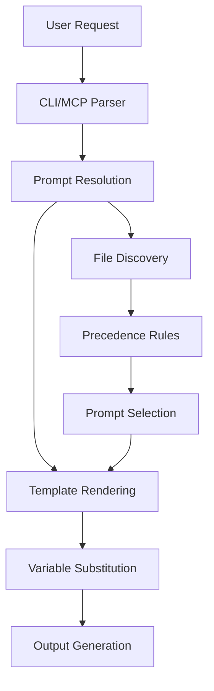
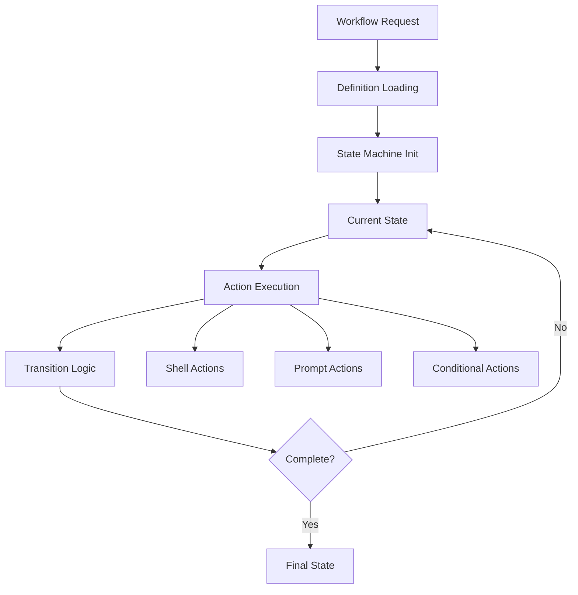
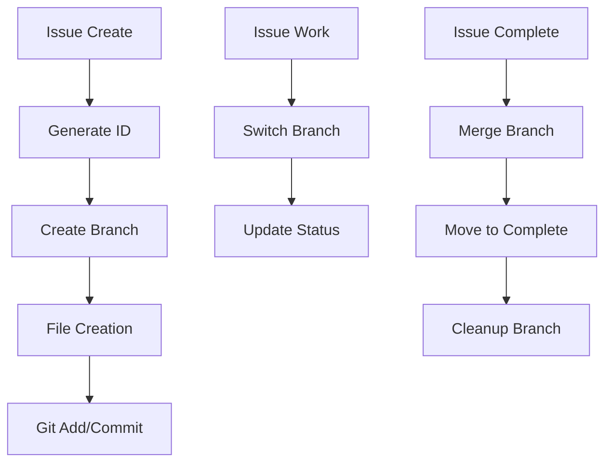

# Architecture Overview

SwissArmyHammer is designed as a modular, extensible system with clear separation of concerns and multiple integration points.

## System Architecture

```
┌─────────────────────────────────────────────────────────────┐
│                    User Interfaces                          │
├─────────────────┬─────────────────┬─────────────────────────┤
│   CLI Application│   MCP Server    │   Rust Library API     │
│   (sah command)  │   (Claude Code) │   (Direct Integration)  │
└─────────────────┴─────────────────┴─────────────────────────┘
                          │
┌─────────────────────────┼─────────────────────────────────────┐
│                    Core Library                              │
│                (swissarmyhammer)                             │
├──────────────────────────────────────────────────────────────┤
│  Prompt System  │  Workflow Engine  │  Storage & Search     │
│  ┌─────────────┐│  ┌──────────────┐│  ┌──────────────────┐  │
│  │PromptLibrary││  │ State Machine││  │ Issue Management │  │
│  │Template Eng.││  │ Transitions  ││  │ Memoranda System │  │
│  │Liquid Support│  │ Actions      ││  │ Semantic Search  │  │
│  └─────────────┘│  └──────────────┘│  └──────────────────┘  │
└──────────────────────────────────────────────────────────────┘
                          │
┌─────────────────────────┼─────────────────────────────────────┐
│                   Infrastructure                             │
├──────────────────────────────────────────────────────────────┤
│  File System    │   Git Integration │   Vector Database     │
│  ┌─────────────┐│   ┌─────────────┐│   ┌─────────────────┐  │
│  │ FileLoader  ││   │ Branch Mgmt ││   │ DuckDB Storage  │  │
│  │ FileWatcher ││   │ Issue Hooks ││   │ TreeSitter      │  │
│  │ VFS Support ││   │ Auto Commit ││   │ Embedding Model │  │
│  └─────────────┘│   └─────────────┘│   └─────────────────┘  │
└──────────────────────────────────────────────────────────────┘
```

## Core Components

### 1. SwissArmyHammer Library (`swissarmyhammer`)

The core library provides the fundamental functionality:

#### Prompt Management
- **PromptLibrary**: Central registry for all prompts
- **PromptLoader**: File system integration and loading
- **Template Engine**: Liquid template processing with custom filters
- **PromptResolver**: Multi-source resolution with precedence

#### Workflow System
- **State Machine**: Finite state automaton for workflow execution
- **Action System**: Pluggable actions (shell, prompt, conditional, etc.)
- **Transition Engine**: State transitions with validation
- **Execution Engine**: Parallel and sequential execution support

#### Storage Systems
- **Issue Management**: Git-integrated issue tracking
- **Memoranda**: Note-taking and knowledge management
- **Semantic Search**: Vector-based search with TreeSitter parsing
- **File System Abstraction**: Virtual file system for testing

### 2. CLI Application (`swissarmyhammer-cli`)

Command-line interface providing:

- **Command Processing**: Clap-based argument parsing
- **Interactive Features**: Fuzzy selection, confirmation prompts
- **Output Formatting**: Table, JSON, and human-readable formats
- **Shell Integration**: Completions and signal handling
- **Configuration Management**: TOML-based configuration

### 3. MCP Tools (`swissarmyhammer-tools`)

Model Context Protocol server providing:

- **Tool Registry**: Dynamic tool registration and discovery
- **CLI Exclusion System**: Trait-based marking for workflow-only tools
- **Request Handling**: Structured request/response processing
- **Error Management**: Comprehensive error reporting
- **Type Safety**: Full JSON schema validation

## Data Flow

### Prompt Execution Flow



### Workflow Execution Flow



### Issue Management Flow



## File System Organization

### Directory Structure
```
~/.swissarmyhammer/           # User directory
├── prompts/                  # User prompts
├── workflows/                # User workflows
├── memoranda/                # Personal notes
├── issues/                   # Issue tracking
│   ├── active/              # Active issues
│   └── complete/            # Completed issues
├── search.db                # Semantic search index
├── sah.toml                 # Configuration
└── cache/                   # Temporary files

./.swissarmyhammer/          # Project directory
├── prompts/                 # Project prompts
├── workflows/               # Project workflows
├── memoranda/               # Project notes
└── issues/                  # Project issues
```

### File Types

#### Prompts (`*.md`)
```markdown
---
title: Example Prompt
description: Description of what this prompt does
arguments:
  - name: arg1
    description: First argument
    required: true
    default: "default_value"
---

Prompt content with {{arg1}} substitution.
```

#### Workflows (`*.md`)
```markdown
---
name: example-workflow
description: Example workflow
initial_state: start
states:
  start:
    description: Starting state
    transitions:
      - to: end
        condition: "success"
---

## State Definitions
[Detailed state descriptions...]
```

## Integration Points

### Claude Code MCP Integration

SwissArmyHammer integrates with Claude Code through the Model Context Protocol:

```json
{
  "servers": {
    "sah": {
      "command": "sah",
      "args": ["serve"],
      "env": {
        "SAH_LOG_LEVEL": "info"
      }
    }
  }
}
```

**Available Tools:**
- `issue_*` - Issue management tools (issue_create, issue_list, issue_work, etc.)
  - Note: Some tools like `issue_work` and `issue_merge` are marked with `#[cli_exclude]` for MCP-only usage
- `memo_*` - Memoranda tools (memo_create, memo_list, memo_get, etc.)
- `search_*` - Semantic search tools (search_index, search_query)
- `outline_*` - Code outline tools (outline_generate)
- `abort_*` - Workflow control tools (abort_create)

The system includes a [CLI Exclusion System](cli-exclusion-system.md) that distinguishes between user-facing tools and workflow orchestration tools designed specifically for MCP protocol interactions.

### Git Integration

Issue management integrates deeply with Git:

- **Branch Management**: Automatic branch creation/switching
- **Commit Integration**: Automatic commits for issue lifecycle
- **Merge Handling**: Safe merging with conflict detection
- **Status Tracking**: Branch-based status determination

### Vector Search Integration

Semantic search uses modern AI techniques:

- **TreeSitter Parsing**: Language-aware code parsing
- **Embedding Models**: `nomic-embed-code` for semantic similarity
- **Vector Storage**: DuckDB for efficient similarity search
- **Indexing Pipeline**: Incremental indexing with change detection

## Plugin Architecture

### Custom Liquid Filters

```rust
use swissarmyhammer::prelude::*;

struct UppercaseFilter;

impl CustomLiquidFilter for UppercaseFilter {
    fn name(&self) -> &str { "uppercase" }
    
    fn filter(&self, input: &str) -> Result<String> {
        Ok(input.to_uppercase())
    }
}

// Register the filter
let mut registry = PluginRegistry::new();
registry.register_filter(Box::new(UppercaseFilter))?;
```

### Custom Workflow Actions

```rust
use swissarmyhammer::workflow::{Action, ActionResult, State};

struct CustomAction {
    command: String,
}

impl Action for CustomAction {
    async fn execute(&self, state: &State) -> ActionResult {
        // Custom action implementation
        ActionResult::Success
    }
}
```

## Security Model

### Path Validation
- All file paths are validated and canonicalized
- Directory traversal attacks are prevented
- Symlink resolution is controlled

### Resource Limits
- Configurable timeouts for all operations
- Memory usage limits for large files
- Process execution limits for shell actions

### Permissions
- Read-only access to prompt directories by default
- Write access only to designated areas
- Git operations are sandboxed to project directory

## Performance Characteristics

### Memory Usage
- Lazy loading of prompts and workflows
- Streaming file processing for large files
- Configurable caching with LRU eviction

### Disk I/O
- File watching with efficient change detection
- Incremental indexing for search
- Batch operations for better throughput

### Network I/O
- Async/await throughout for non-blocking operations
- Connection pooling for MCP servers
- Timeout handling for all network operations

## Testing Strategy

### Unit Tests
- Component isolation with dependency injection
- Mock implementations for external dependencies
- Property-based testing for critical algorithms

### Integration Tests
- End-to-end CLI command testing
- MCP protocol compliance testing
- File system integration testing

### Performance Tests
- Benchmarking for critical paths
- Memory usage profiling
- Regression test suite with baselines

## Complete Plugin Implementation Example

Here's a complete example of implementing a custom plugin with all necessary components:

```rust
use swissarmyhammer::prelude::*;
use serde::{Deserialize, Serialize};
use std::collections::HashMap;

// 1. Plugin Configuration
#[derive(Debug, Deserialize, Serialize)]
pub struct GitLogConfig {
    pub max_commits: usize,
    pub format: String,
    pub include_merges: bool,
}

impl Default for GitLogConfig {
    fn default() -> Self {
        Self {
            max_commits: 10,
            format: "--oneline".to_string(),
            include_merges: false,
        }
    }
}

// 2. Plugin Implementation
#[derive(Debug)]
pub struct GitLogPlugin {
    config: GitLogConfig,
}

impl GitLogPlugin {
    pub fn new(config: GitLogConfig) -> Self {
        Self { config }
    }
}

impl Plugin for GitLogPlugin {
    fn name(&self) -> &str {
        "git_log"
    }
    
    fn description(&self) -> &str {
        "Retrieves git commit history with configurable formatting"
    }
    
    fn process(&self, _input: &str, context: &PluginContext) -> PluginResult<String> {
        let mut args = vec!["log".to_string()];
        
        // Add format
        args.push(self.config.format.clone());
        
        // Add max commits
        args.push(format!("-{}", self.config.max_commits));
        
        // Handle merges
        if !self.config.include_merges {
            args.push("--no-merges".to_string());
        }
        
        // Execute git command
        match std::process::Command::new("git")
            .args(&args)
            .current_dir(context.working_directory.as_deref().unwrap_or("."))
            .output() {
            Ok(output) => {
                if output.status.success() {
                    Ok(String::from_utf8_lossy(&output.stdout).to_string())
                } else {
                    Err(PluginError::ProcessingError {
                        message: format!("Git command failed: {}", 
                                       String::from_utf8_lossy(&output.stderr)),
                        source: None,
                    })
                }
            }
            Err(e) => Err(PluginError::ProcessingError {
                message: format!("Failed to execute git: {}", e),
                source: Some(Box::new(e)),
            }),
        }
    }
}

// 3. Plugin Registration and Usage
fn setup_custom_environment() -> Result<PromptLibrary, Box<dyn std::error::Error>> {
    // Create plugin registry
    let mut plugin_registry = PluginRegistry::with_builtin_plugins();
    
    // Configure and register custom plugin
    let git_config = GitLogConfig {
        max_commits: 5,
        format: "--pretty=format:'%h %s'".to_string(),
        include_merges: false,
    };
    
    plugin_registry.register(Box::new(GitLogPlugin::new(git_config)))?;
    
    // Create prompt library with plugins
    let library = PromptLibrary::new()
        .with_plugin_registry(plugin_registry)
        .add_directory("./prompts")?
        .add_directory("~/.swissarmyhammer/prompts")?;
    
    Ok(library)
}

// 4. Template Usage
fn create_commit_summary_prompt() -> Result<(), Box<dyn std::error::Error>> {
    let template_content = r#"
# Recent Commits

{{ "" | git_log }}

## Analysis
Based on the recent commit history, I can see...
"#;
    
    std::fs::write("./prompts/commit-summary.md", template_content)?;
    Ok(())
}

#[tokio::main]
async fn main() -> Result<(), Box<dyn std::error::Error>> {
    // Setup environment
    let library = setup_custom_environment()?;
    
    // Create example prompt
    create_commit_summary_prompt()?;
    
    // Use the prompt
    let prompt = library.get("commit-summary")?;
    let context = HashMap::new();
    let result = prompt.render(&context)?;
    
    println!("{}", result);
    
    Ok(())
}
```

## Performance Benchmarks and Optimization

### Typical Performance Characteristics

**Prompt Loading**:
- Small prompts (<10KB): ~1-5ms
- Large prompts (>100KB): ~10-50ms  
- Directory scanning (100 files): ~50-200ms

**Template Rendering**:
- Simple templates: ~0.1-1ms
- Complex templates with loops: ~1-10ms
- Templates with file operations: ~10-100ms

**Semantic Search**:
- First query (model loading): ~1-3 seconds
- Subsequent queries: ~50-300ms
- Large codebases (10k+ files): ~200-500ms

**Memory Usage**:
- Base library: ~10-20MB
- With search index: +50-200MB depending on codebase size
- During heavy template rendering: +10-50MB temporary usage

### Performance Optimization Examples

```rust
use swissarmyhammer::config::PerformanceConfig;
use std::time::Duration;

// 1. Configure resource limits
let perf_config = PerformanceConfig {
    max_template_size: 1024 * 1024,  // 1MB
    max_render_time: Duration::from_secs(30),
    max_file_watches: 1000,
    enable_template_caching: true,
    cache_ttl: Duration::from_secs(3600),
    max_concurrent_renders: 10,
    ..Default::default()
};

// 2. Optimized library setup for large projects
let library = PromptLibrary::with_config(Config {
    performance: perf_config,
    ..Default::default()
})
.with_lazy_loading(true)  // Don't load all prompts at startup
.with_file_watching(false)  // Disable for production if not needed
.with_template_cache(1000)  // Cache 1000 rendered templates
.add_directory_filtered("./prompts", |path| {
    // Only load .md files, skip hidden files
    path.extension().map_or(false, |ext| ext == "md") 
        && !path.file_name().unwrap().to_str().unwrap().starts_with('.')
})?;

// 3. Batch operations for better performance
let mut batch_results = Vec::new();
let prompts = ["template1", "template2", "template3"];

// Process in parallel
let handles: Vec<_> = prompts.iter().map(|name| {
    let library = library.clone();
    let context = context.clone();
    tokio::spawn(async move {
        library.get(name)?.render(&context)
    })
}).collect();

for handle in handles {
    batch_results.push(handle.await??);
}
```

## Troubleshooting Guide

### Common Architecture Issues

#### Plugin Loading Problems

**Symptoms**:
- "Plugin not found" errors
- "Failed to register plugin" messages
- Unexpected plugin behavior

**Diagnosis**:
```rust
// Enable debug logging to see plugin registration
use swissarmyhammer::plugins::PluginRegistry;
use log::LevelFilter;

env_logger::Builder::from_default_env()
    .filter_level(LevelFilter::Debug)
    .init();

let registry = PluginRegistry::new();
println!("Available plugins: {:?}", registry.list_plugins());
```

**Solutions**:
1. Verify plugin is properly registered before use
2. Check plugin name matches exactly (case-sensitive)
3. Ensure plugin dependencies are available
4. Validate plugin configuration is correct

#### Memory Issues

**Symptoms**:
- Out of memory errors during template rendering
- Slow performance with large prompt collections
- High memory usage that doesn't decrease

**Diagnosis**:
```bash
# Monitor memory usage
top -p $(pgrep sah)

# Enable memory profiling (requires build with profiling)
MALLOC_CONF="prof:true,prof_leak:true" sah prompt render large-template
```

**Solutions**:
```rust
// 1. Configure memory limits
let config = Config {
    security: SecurityConfig {
        max_template_size: 512 * 1024,  // 512KB limit
        max_memory_usage: 100 * 1024 * 1024,  // 100MB limit
        ..Default::default()
    },
    ..Default::default()
};

// 2. Use streaming for large files
use swissarmyhammer::template::StreamingTemplate;

let template = StreamingTemplate::from_file("large-template.md")?;
let mut output = std::fs::File::create("output.txt")?;
template.render_to_writer(&context, &mut output)?;

// 3. Manual cleanup for long-running processes
library.clear_cache();
library.collect_garbage();
```

#### File System Integration Issues

**Symptoms**:
- File watching doesn't trigger updates
- Permission denied errors
- Symlinks not resolved correctly

**Diagnosis**:
```bash
# Check file permissions
ls -la ~/.swissarmyhammer/
ls -la ./.swissarmyhammer/

# Test file watching manually
inotifywait -m -r ~/.swissarmyhammer/

# Verify symlink resolution
readlink -f ~/.swissarmyhammer/prompts/my-prompt.md
```

**Solutions**:
```rust
// 1. Configure file system options
let fs_config = FileSystemConfig {
    follow_symlinks: true,
    case_sensitive: cfg!(target_os = "linux"),
    max_file_size: 10 * 1024 * 1024,  // 10MB
    allowed_extensions: vec!["md".to_string(), "yaml".to_string()],
    ..Default::default()
};

// 2. Handle permission errors gracefully
match library.add_directory("./prompts") {
    Ok(_) => println!("Directory added successfully"),
    Err(e) if e.kind() == ErrorKind::PermissionDenied => {
        eprintln!("Permission denied - check directory permissions");
        std::process::exit(1);
    }
    Err(e) => return Err(e.into()),
}

// 3. Validate paths before use
use swissarmyhammer::security::PathValidator;

let validator = PathValidator::new()
    .allow_directory("./prompts")
    .allow_directory("~/.swissarmyhammer")
    .deny_patterns(&["*.exe", "*.dll"]);

if validator.validate(path)? {
    library.add_file(path)?;
}
```

### Performance Troubleshooting

#### Slow Template Rendering

**Diagnosis Steps**:
1. Enable timing logs: `RUST_LOG=swissarmyhammer::template=debug`
2. Profile template complexity
3. Check for infinite loops in Liquid templates
4. Monitor file I/O during rendering

**Solutions**:
```rust
// 1. Template complexity analysis
use swissarmyhammer::template::TemplateAnalyzer;

let analyzer = TemplateAnalyzer::new();
let metrics = analyzer.analyze_file("complex-template.md")?;

println!("Variables: {}", metrics.variable_count);
println!("Loops: {}", metrics.loop_count);  
println!("Includes: {}", metrics.include_count);
println!("Estimated complexity: {}", metrics.complexity_score);

// 2. Implement timeouts
use std::time::Duration;
use tokio::time::timeout;

let render_future = prompt.render_async(&context);
let result = timeout(Duration::from_secs(30), render_future).await?;
```

#### Search Performance Issues

**Common Issues**:
- First search very slow (model loading)
- Large result sets cause timeout
- Index corruption or outdated data

**Solutions**:
```rust
// 1. Warm up search model at startup
use swissarmyhammer::search::SearchEngine;

let engine = SearchEngine::new(config)?;
engine.warmup().await?;  // Pre-load embedding model

// 2. Implement result pagination
let query = SearchQuery {
    text: "error handling".to_string(),
    offset: 0,
    limit: 25,  // Smaller result sets
    ..Default::default()
};

// 3. Rebuild index if corrupted
if engine.verify_index().await.is_err() {
    println!("Index corrupted, rebuilding...");
    engine.rebuild_index(&["**/*.rs"]).await?;
}
```

### Error Recovery Patterns

```rust
use swissarmyhammer::error::{SwissArmyHammerError, ErrorRecovery};

// Implement comprehensive error recovery
async fn robust_prompt_rendering(
    library: &PromptLibrary,
    prompt_name: &str,
    context: &HashMap<String, String>,
) -> Result<String, SwissArmyHammerError> {
    
    // Attempt 1: Normal rendering
    match library.get(prompt_name)?.render(context) {
        Ok(result) => return Ok(result),
        Err(SwissArmyHammerError::TemplateError(_)) => {
            // Template error - try fallback template
            if let Ok(fallback) = library.get(&format!("{}-fallback", prompt_name)) {
                return fallback.render(context);
            }
        }
        Err(SwissArmyHammerError::IoError(_)) => {
            // File I/O error - try reloading directory
            library.reload_directory("./prompts")?;
            return library.get(prompt_name)?.render(context);
        }
        Err(e) => return Err(e),
    }
    
    // All recovery attempts failed
    Err(SwissArmyHammerError::ProcessingError {
        message: format!("Failed to render prompt '{}' after recovery attempts", prompt_name),
        source: None,
    })
}
```

This architecture provides a solid foundation for extensibility while maintaining clear separation of concerns and robust error handling throughout the system. The comprehensive examples and troubleshooting guide help developers understand both the design principles and practical implementation details.