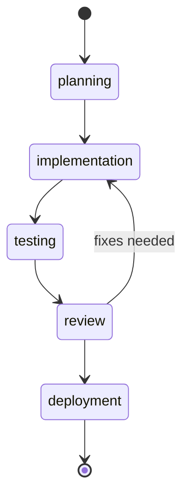

# Features Overview

SwissArmyHammer provides a comprehensive platform for AI-powered development workflows. This overview covers all major capabilities with practical examples.

## File-Based Architecture

### Markdown-First Approach
Store prompts and workflows as simple markdown files with YAML front matter:

```markdown
---
title: API Documentation Generator
description: Generate API documentation from code
arguments:
  - name: service_name
    description: Name of the service
    required: true
  - name: language
    description: Programming language
    choices: ["rust", "python", "typescript"]
    default: "rust"
---

# {{service_name}} API Documentation

Generate comprehensive API documentation for {{service_name}} written in {{language}}.

Focus on:

- Struct and enum definitions
- Trait implementations
- Error handling patterns

- Class definitions and methods
- Type hints and annotations
- Exception handling

- Interface definitions
- Type definitions
- Error handling patterns

```

### Hierarchical Organization
Three-tier system with clear precedence:

1. **Builtin** (`embedded`) - 20+ production-ready prompts and workflows
2. **User** (`~/.swissarmyhammer/`) - Your personal collection 
3. **Local** (`./.swissarmyhammer/`) - Project-specific customizations

### Live Reloading
Changes are automatically detected and applied without restart:
- File system watching using native events
- Instant prompt updates in running applications
- Hot reload during development and testing

## Template Engine

### Liquid Templating
Powerful template processing with variables, logic, and filters:

```liquid
# Code Review for {{author}}



## Critical Files Requiring Extra Attention

- {{file.path}} - {{file.reason}}





Focus on security vulnerabilities and data handling.
  
Focus on performance bottlenecks and optimization opportunities.

Standard code review focusing on quality and maintainability.

```

### Custom Filters
Extensible filter system for domain-specific operations:
- String manipulation and formatting
- Date and time operations
- File system operations
- Custom business logic

## Developer Experience

### Command Line Interface
Comprehensive CLI with intuitive subcommands:

```bash
# Prompt management
sah prompt list                    # List available prompts
sah prompt test my-prompt         # Test prompt rendering
sah prompt validate my-prompt     # Validate prompt syntax

# Workflow execution  
sah flow run deployment           # Execute workflow
sah flow status                   # Check running workflows
sah flow history                  # View execution history

# Issue tracking
sah issue create "Fix login bug"  # Create new issue
sah issue work ISSUE-123          # Switch to issue branch
sah issue merge ISSUE-123         # Merge completed issue

# System diagnostics
sah doctor                        # Health check
sah validate                      # Validate configuration
```

### Shell Integration
Full shell completion support:
- **Bash**: Complete commands, options, and file paths
- **Zsh**: Advanced completions with descriptions
- **Fish**: Interactive completions with context
- **PowerShell**: Windows-native completion experience

## Workflow Engine

### State-Based Execution
Workflows use finite state machines with Mermaid diagram visualization:



### Workflow Definition
```markdown
---
name: feature-deployment
description: Complete feature deployment workflow
initial_state: planning
variables:
  - name: feature_name
    required: true
  - name: environment
    choices: ["staging", "production"]
    default: "staging"
---

### planning
**Description**: Plan feature deployment strategy

**Actions**:
- prompt: deployment-plan feature="{{feature_name}}" env="{{environment}}"
- memo: Record deployment plan

**Next**: implementation

### implementation
**Description**: Deploy the feature

**Actions**:
- shell: `deploy-feature --name {{feature_name}} --env {{environment}}`
- conditional: Check deployment success

**Transitions**:
- If successful → testing
- If failed → rollback

### testing
**Description**: Validate deployment

**Actions**:
- shell: `run-smoke-tests --env {{environment}}`
- wait: 5 minutes

**Next**: review
```

### Action Types
- **Prompt Actions**: Execute prompts with context
- **Shell Actions**: Run system commands with output capture
- **Conditional Actions**: Branch based on conditions
- **Wait Actions**: Pause execution for specified duration
- **Memo Actions**: Create notes and documentation

## Issue Management

### Git-Integrated Workflow
Automatic branch management with issue lifecycle tracking:

```bash
# Create issue and branch
sah issue create "Fix authentication bug"
# → Creates issue-ISSUE-123-fix-authentication-bug branch

# Start working
sah issue work ISSUE-123
# → Switches to issue branch automatically

# Complete and merge
sah issue complete ISSUE-123
# → Merges branch and moves issue to completed
```

### Issue Templates
Structured issue creation with templates:
```markdown
---
title: Bug Report Template
type: bug
priority: medium
---

## Bug Description
Brief description of the issue.

## Steps to Reproduce
1. Step one
2. Step two
3. Step three

## Expected Behavior
What should happen.

## Actual Behavior  
What actually happens.

## Environment
- OS: {{os}}
- Version: {{version}}
```

## Memoranda System

### Knowledge Management
Markdown-based note-taking with full-text search:

```bash
# Create meeting notes
sah memo create "Sprint Planning" --content "# Sprint Planning Meeting..."

# Search notes
sah memo search "authentication requirements"

# Update existing notes
sah memo update MEMO-456 --content "Updated requirements..."
```

### Organized Storage
- Automatic timestamping and ULID generation
- Full-text search across all memos
- Markdown formatting with syntax highlighting
- Integration with workflows and issue tracking

## Semantic Search

### AI-Powered Code Search
Vector embedding-based search using TreeSitter parsing:

```bash
# Index codebase
sah search index "**/*.rs" "**/*.py" "**/*.ts"

# Semantic search
sah search query "error handling patterns"
sah search query "async function implementation"
sah search query "database connection management"
```

### Language Support
- **Rust**: Structs, enums, functions, traits, modules
- **Python**: Classes, functions, methods, imports
- **TypeScript/JavaScript**: Classes, interfaces, functions, types
- **Dart**: Classes, functions, methods, constructors

### Intelligent Parsing
TreeSitter provides language-aware code analysis:
- Function signatures and documentation
- Type definitions and relationships
- Module boundaries and exports
- Comment extraction and indexing

## MCP Integration

### Claude Code Tools
Complete MCP tool suite for seamless AI development:

```bash
# Configure Claude Code
claude mcp add --scope user sah sah serve
```

**Available Tools**:
- `issue_*` - Complete issue lifecycle management
- `memo_*` - Note-taking and knowledge management  
- `search_*` - Semantic code search capabilities
- `outline_*` - Code structure generation
- `abort_*` - Workflow control and termination

### Type-Safe Communication
- Structured JSON-RPC with full schema validation
- Comprehensive error handling and recovery
- Real-time status updates and progress tracking
- Automatic tool discovery and registration

## Built-in Resources

### Production-Ready Prompts
20+ built-in prompts for common development tasks:

**Code Quality**
- `code` - General code analysis and suggestions
- `review/code` - Comprehensive code review
- `review/security` - Security-focused code review
- `test` - Test generation and strategies

**Documentation**  
- `docs/readme` - README file generation
- `docs/comments` - Inline code documentation
- `docs/project` - Project documentation
- `documentation` - General documentation tasks

**Development Process**
- `plan` - Project and feature planning
- `standards` - Coding standards enforcement
- `principals` - Development principles guidance
- `debug/error` - Error analysis and debugging

### Example Workflows
Built-in workflows demonstrating best practices:

**Feature Development**
- `hello-world` - Basic workflow example
- `tdd` - Test-driven development process
- `implement` - Feature implementation workflow

**Process Automation**
- `code_issue` - End-to-end issue resolution
- `review_docs` - Documentation quality review
- `complete_issue` - Issue completion workflow

### Quick Access
All built-in resources are immediately available:
```bash
# List built-in prompts
sah prompt list --builtin

# Test built-in prompt
sah prompt test code --var language=rust

# Run built-in workflow  
sah flow run hello-world
```

## Performance & Security

### Scalability
- Handles codebases with 10,000+ files efficiently
- Lazy loading and configurable caching for memory efficiency  
- Parallel processing for better throughput
- Incremental updates for changed files only

### Security
- Directory traversal protection and path validation
- Controlled symlink handling and permission checking
- Configurable resource limits and timeout controls
- Input validation and output sanitization

### Reliability
- Graceful error handling with recovery options
- Automatic cleanup of temporary resources
- Atomic operations with rollback capabilities
- Cross-platform consistency (Windows, macOS, Linux)

This comprehensive platform combines the simplicity of markdown files with powerful AI integration, providing everything needed for modern development workflows.