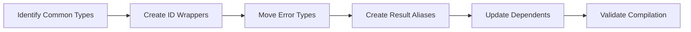

# Move Common Types to swissarmyhammer-common

Refer to /Users/wballard/github/swissarmyhammer/ideas/dependencies.md

## Goal

Extract and consolidate common type definitions from existing crates into `swissarmyhammer-common/src/types/`.

## Tasks

1. Identify common types across crates
2. Create ULID wrapper types
3. Move error types and result aliases
4. Update existing crates to use common types

## Implementation Details

### Types to Move/Create

#### ID Types (`src/types/ids.rs`)
```rust
pub struct MemoId(pub ulid::Ulid);
pub struct IssueId(pub ulid::Ulid);
pub struct WorkflowId(pub ulid::Ulid);
pub struct TodoId(pub ulid::Ulid);
```

#### Error Types (`src/types/errors.rs`)
```rust
#[derive(Debug, thiserror::Error)]
pub enum CommonError {
    #[error("IO error: {0}")]
    Io(#[from] std::io::Error),
    #[error("Validation error: {0}")]
    Validation(String),
    // ... other common errors
}
```

#### Result Aliases (`src/types/results.rs`)
```rust
pub type Result<T> = std::result::Result<T, CommonError>;
```

### Migration Sources
- Extract from `swissarmyhammer/src/common/`
- Consolidate scattered ID types
- Unify error handling patterns

## Validation

- [ ] All ID types implement necessary traits (Debug, Clone, Serialize, etc.)
- [ ] Error types provide proper source chain support
- [ ] Existing crates compile after type migration
- [ ] No circular dependencies introduced

## Mermaid Diagram



This step provides type safety and consistency across all domain crates.