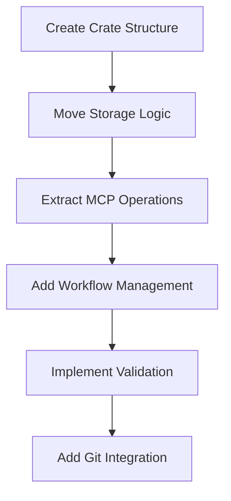

# Create swissarmyhammer-issues Crate

Refer to /Users/wballard/github/swissarmyhammer/ideas/dependencies.md

## Goal

Create a dedicated crate for issue management by extracting issue functionality from both the main library and MCP tools.

## Tasks

1. Create new crate structure
2. Move issue domain logic from main library
3. Extract issue operations from MCP tools
4. Create clean issue management API

## Implementation Details

### Crate Structure
```
swissarmyhammer-issues/
├── Cargo.toml
├── src/
│   ├── lib.rs
│   ├── storage.rs         # Issue storage abstraction
│   ├── filesystem.rs      # File-based storage implementation
│   ├── validation.rs      # Issue validation logic
│   ├── operations.rs      # Core CRUD operations
│   ├── workflows.rs       # Issue workflow management
│   ├── metrics.rs         # Issue metrics and reporting
│   ├── types.rs           # Issue-specific types
│   └── error.rs           # Issue-specific errors
```

### Core Dependencies
- `swissarmyhammer-common` - Common types and utilities
- `swissarmyhammer-git` - Git integration
- `serde` - Serialization
- `async-trait` - Async traits
- `tokio` - Async runtime

### Key APIs to Extract

#### From `swissarmyhammer/src/issues/`
```rust
pub struct FileSystemIssueStorage {
    // Move existing implementation
}

#[async_trait]
impl IssueStorage for FileSystemIssueStorage {
    async fn create_issue(&self, name: String, content: String) -> Result<Issue, IssueError>;
    async fn get_issue(&self, name: &str) -> Result<Issue, IssueError>;
    async fn update_issue(&self, name: &str, content: String) -> Result<Issue, IssueError>;
    // ... other operations
}
```

#### From MCP Tools
```rust
pub struct IssueService {
    storage: Box<dyn IssueStorage>,
    git_ops: GitOperations,
}

impl IssueService {
    pub async fn create(&self, request: CreateIssueRequest) -> Result<Issue, IssueError>;
    pub async fn work_on(&self, name: &str) -> Result<(), IssueError>;
    pub async fn mark_complete(&self, name: &str) -> Result<Issue, IssueError>;
}
```

## Migration Sources
- `swissarmyhammer/src/issues/` - All issue modules
- `swissarmyhammer-tools/src/mcp/tools/issues/` - MCP tool implementations
- Issue-related utilities and validation

## Validation

- [ ] All issue CRUD operations work correctly
- [ ] Git integration functions properly
- [ ] Issue validation is comprehensive
- [ ] Workflow management is robust
- [ ] Metrics collection is accurate

## Mermaid Diagram



This crate will provide a comprehensive issue management system that can be used independently of MCP.