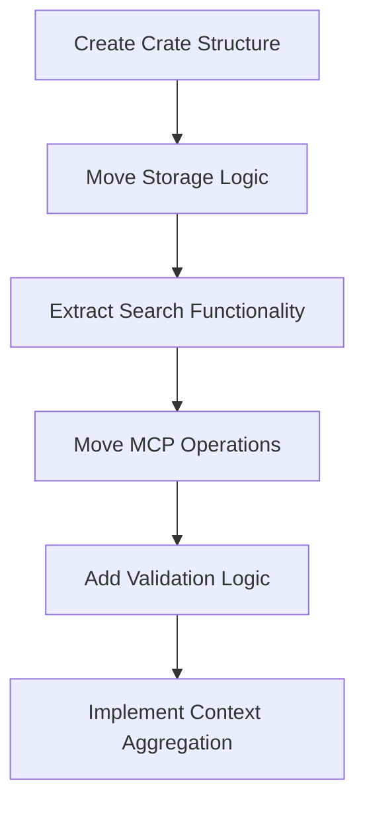

# Create swissarmyhammer-memoranda Crate

Refer to /Users/wballard/github/swissarmyhammer/ideas/dependencies.md

## Goal

Create a dedicated crate for memo management by extracting memoranda functionality from both the main library and MCP tools.

## Tasks

1. Create new crate structure
2. Move memo domain logic from main library
3. Extract memo operations from MCP tools
4. Create clean memo management API

## Implementation Details

### Crate Structure
```
swissarmyhammer-memoranda/
├── Cargo.toml
├── src/
│   ├── lib.rs
│   ├── storage.rs         # Memo storage abstraction
│   ├── markdown.rs        # Markdown-based storage implementation
│   ├── search.rs          # Memo search functionality
│   ├── validation.rs      # Memo validation logic
│   ├── operations.rs      # Core CRUD operations
│   ├── types.rs           # Memo-specific types
│   └── error.rs           # Memo-specific errors
```

### Core Dependencies
- `swissarmyhammer-common` - Common types and utilities
- `serde` - Serialization support
- `async-trait` - Async trait support
- `tokio` - Async runtime
- `regex` - Text search patterns

### Key APIs to Extract

#### From `swissarmyhammer/src/memoranda/`
```rust
pub struct MarkdownMemoStorage {
    // Move existing implementation
}

#[async_trait]
impl MemoStorage for MarkdownMemoStorage {
    async fn create(&mut self, memo: CreateMemoRequest) -> Result<Memo, MemoError>;
    async fn get(&self, id: &MemoId) -> Result<Option<Memo>, MemoError>;
    async fn update(&mut self, id: &MemoId, content: String) -> Result<Memo, MemoError>;
    async fn delete(&mut self, id: &MemoId) -> Result<bool, MemoError>;
    async fn list(&self) -> Result<Vec<Memo>, MemoError>;
    async fn search(&self, query: &str) -> Result<Vec<Memo>, MemoError>;
}
```

#### From MCP Tools
```rust
pub struct MemoService {
    storage: Box<dyn MemoStorage>,
}

impl MemoService {
    pub async fn create(&mut self, title: String, content: String) -> Result<Memo, MemoError>;
    pub async fn get_all_context(&self) -> Result<String, MemoError>;
    pub async fn search(&self, query: &str) -> Result<Vec<MemoSearchResult>, MemoError>;
}
```

## Migration Sources
- `swissarmyhammer/src/memoranda/` - All memo modules
- `swissarmyhammer-tools/src/mcp/tools/memoranda/` - MCP tool implementations
- Advanced search functionality

## Validation

- [ ] All memo CRUD operations work correctly
- [ ] Search functionality is accurate
- [ ] Markdown parsing is robust
- [ ] Context aggregation works properly
- [ ] Storage abstraction is flexible

## Mermaid Diagram



This crate will provide a comprehensive memo management system with full-text search capabilities.