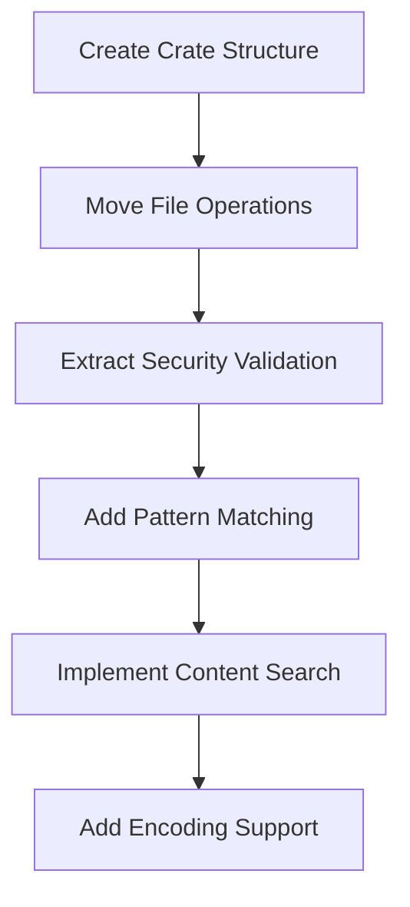

# Create swissarmyhammer-files Crate

Refer to /Users/wballard/github/swissarmyhammer/ideas/dependencies.md

## Goal

Create a dedicated crate for file operations by extracting file handling functionality from scattered locations across the codebase.

## Tasks

1. Create new crate structure
2. Move file utilities from main library
3. Extract file operations from MCP tools
4. Create clean file manipulation API

## Implementation Details

### Crate Structure
```
swissarmyhammer-files/
├── Cargo.toml
├── src/
│   ├── lib.rs
│   ├── operations.rs      # Core file operations (read/write/edit)
│   ├── security.rs        # Path validation and security
│   ├── glob.rs           # Pattern matching and file discovery
│   ├── grep.rs           # Content search within files
│   ├── encoding.rs       # File encoding detection and handling
│   ├── types.rs          # File-specific types
│   └── error.rs          # File-specific errors
```

### Core Dependencies
- `swissarmyhammer-common` - Common types and utilities
- `tokio` - Async file operations
- `encoding_rs` - Character encoding detection
- `glob` - Pattern matching
- `regex` - Content search
- `filetime` - File metadata preservation

### Key APIs to Extract

#### From MCP Tools File Operations
```rust
pub struct FileOperations {
    // Consolidate from MCP tools
}

impl FileOperations {
    pub async fn read_file(&self, path: &Path) -> Result<FileContent, FileError>;
    pub async fn write_file(&self, path: &Path, content: &str) -> Result<(), FileError>;
    pub async fn edit_file(&self, path: &Path, old: &str, new: &str) -> Result<EditResult, FileError>;
}
```

#### Security and Validation
```rust
pub struct PathValidator {
    // Move from scattered security checks
}

impl PathValidator {
    pub fn validate_path(&self, path: &Path) -> Result<(), SecurityError>;
    pub fn sanitize_path(&self, path: &str) -> Result<PathBuf, ValidationError>;
}
```

#### Pattern Matching
```rust
pub struct GlobMatcher {
    // Extract from MCP glob tool
}

impl GlobMatcher {
    pub async fn find_files(&self, pattern: &str) -> Result<Vec<PathBuf>, GlobError>;
}
```

## Migration Sources
- `swissarmyhammer-tools/src/mcp/tools/files/` - All file MCP tools
- `swissarmyhammer/src/fs_utils.rs` - File system utilities
- Security validation from various modules
- Encoding and metadata handling

## Validation

- [ ] File reading handles all supported encodings
- [ ] File writing is atomic and safe
- [ ] Path validation prevents security issues
- [ ] Pattern matching works correctly
- [ ] Content search is efficient and accurate

## Mermaid Diagram



This crate will provide secure, efficient file operations with comprehensive validation and encoding support.