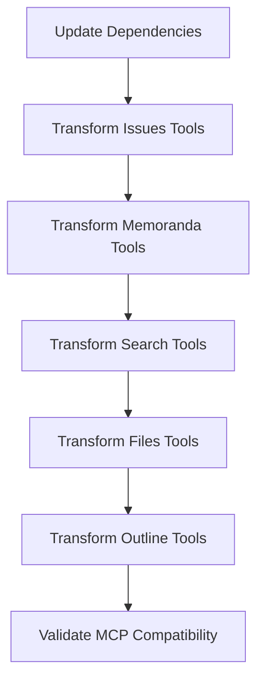

# Update MCP Tools to Use Domain Crates


## Goal

Transform MCP tools from containing domain logic to being thin wrappers that call domain crates, eliminating the circular dependency issue.

## Tasks

1. Update MCP tools Cargo.toml dependencies
2. Replace domain logic with domain crate calls
3. Maintain MCP protocol compatibility
4. Simplify tool implementations

## Implementation Details

### Updated Dependencies in Cargo.toml
```toml
[dependencies]
swissarmyhammer-common = { path = "../swissarmyhammer-common" }
swissarmyhammer-git = { path = "../swissarmyhammer-git" }
swissarmyhammer-issues = { path = "../swissarmyhammer-issues" }
swissarmyhammer-memoranda = { path = "../swissarmyhammer-memoranda" }
swissarmyhammer-search = { path = "../swissarmyhammer-search" }
swissarmyhammer-files = { path = "../swissarmyhammer-files" }
swissarmyhammer-outline = { path = "../swissarmyhammer-outline" }
# Remove dependency on main swissarmyhammer crate
```

### Tool Transformation Pattern
Before (domain logic in MCP tool):
```rust
impl McpTool for CreateIssueTool {
    async fn call(&self, args: serde_json::Value) -> CallToolResult {
        // Complex domain logic here
        let issue = Issue::new(name, content)?;
        issue.save_to_filesystem()?;
        // ... more domain logic
    }
}
```

After (thin wrapper calling domain crate):
```rust
impl McpTool for CreateIssueTool {
    async fn call(&self, args: serde_json::Value) -> CallToolResult {
        let request: CreateIssueRequest = serde_json::from_value(args)?;
        let service = IssueService::new()?;
        let issue = service.create(request).await?;
        Ok(create_issue_response(issue))
    }
}
```

### Tools to Transform
- `issues/*` → Use `swissarmyhammer-issues`
- `memoranda/*` → Use `swissarmyhammer-memoranda`
- `search/*` → Use `swissarmyhammer-search`
- `files/*` → Use `swissarmyhammer-files`
- `outline/*` → Use `swissarmyhammer-outline`

### MCP Protocol Compatibility
- All tool names and schemas remain the same
- Request/response formats unchanged
- Error handling maintains MCP error format
- Tool descriptions and documentation preserved

## Validation

- [ ] All MCP tools compile successfully
- [ ] Tool functionality remains identical from external perspective
- [ ] MCP protocol compliance is maintained
- [ ] Error handling works correctly
- [ ] Performance is acceptable

## Mermaid Diagram



This transformation eliminates circular dependencies and makes MCP tools simple protocol adapters.
