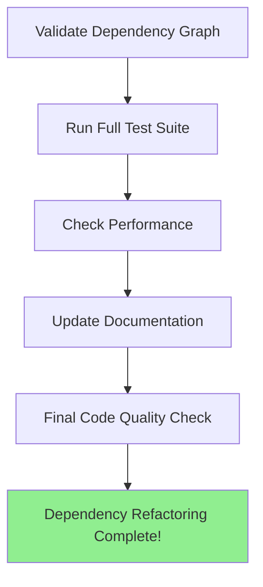

# Final Validation and Cleanup

Refer to /Users/wballard/github/swissarmyhammer/ideas/dependencies.md

## Goal

Perform comprehensive validation of the refactored dependency structure and clean up any remaining issues to complete the transformation.

## Tasks

1. Validate dependency graph has no cycles
2. Run comprehensive test suite
3. Verify performance characteristics
4. Update documentation
5. Clean up any remaining duplicated code

## Implementation Details

### Dependency Graph Validation
```bash
# Use cargo to verify no circular dependencies
cargo tree --duplicates
cargo check --workspace
```

Expected final structure:
```
swissarmyhammer-common (no dependencies on other workspace crates)
├── swissarmyhammer-config
├── swissarmyhammer-git → common
├── swissarmyhammer-issues → common, git
├── swissarmyhammer-memoranda → common
├── swissarmyhammer-search → common
├── swissarmyhammer-files → common
├── swissarmyhammer-outline → common
└── swissarmyhammer → all domain crates
    ├── swissarmyhammer-tools → all domain crates (not main lib!)
    └── swissarmyhammer-cli → all domain crates + main lib
```

### Comprehensive Testing
- [ ] All unit tests pass in each crate
- [ ] Integration tests work across crate boundaries
- [ ] MCP protocol compatibility tests pass
- [ ] CLI integration tests pass
- [ ] Performance regression tests pass

### Documentation Updates
- [ ] Update README files for each new crate
- [ ] Update main project documentation
- [ ] Update API documentation
- [ ] Create migration guide for users

### Performance Validation
- [ ] Compilation times are acceptable
- [ ] Runtime performance is maintained or improved
- [ ] Memory usage is reasonable
- [ ] Binary size is acceptable

### Code Quality Checks
```bash
cargo clippy --workspace --all-targets
cargo fmt --all -- --check
cargo test --workspace
```

## Clean Architecture Benefits

### Achieved Goals
✅ **Eliminated Circular Dependencies**: No crate depends on a higher-level crate
✅ **Modular Design**: Each domain is self-contained and reusable
✅ **Clear Separation**: MCP tools are thin protocol adapters
✅ **Reusable Logic**: Domain crates can be used independently
✅ **Maintainable**: Changes to one domain don't affect others

### Dependency Flow
```
External Users
├── CLI → Domain Crates (direct, efficient)
├── MCP Tools → Domain Crates (protocol adapter)
└── Main Library → Domain Crates (orchestration)
```

## Validation Checklist

- [ ] No circular dependencies in cargo tree
- [ ] All workspace crates compile successfully
- [ ] All tests pass (`cargo test --workspace`)
- [ ] All clippy lints pass (`cargo clippy --workspace`)
- [ ] Formatting is correct (`cargo fmt --all`)
- [ ] Documentation builds (`cargo doc --workspace`)
- [ ] Binary size is reasonable
- [ ] Performance benchmarks pass

## Mermaid Diagram



This final step ensures the refactoring is complete and the new architecture is solid.