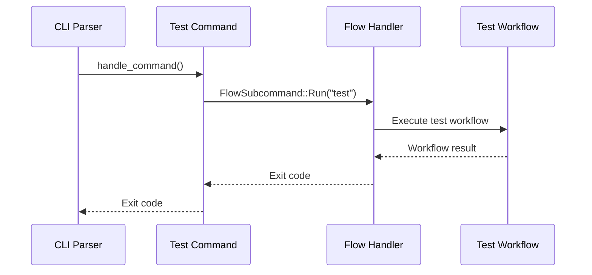

# Step 3: Implement Test Command Handler

Refer to /Users/wballard/github/sah/ideas/test.md

## Objective
Complete the implementation of the test command handler by following the exact pattern established in the `implement` command.

## Task Details

### Command Handler Implementation
Update `swissarmyhammer-cli/src/commands/test/mod.rs`:

```rust
use crate::cli::FlowSubcommand;

pub async fn handle_command(template_context: &swissarmyhammer_config::TemplateContext) -> i32 {
    // Execute the test workflow - equivalent to 'flow run test'
    let subcommand = FlowSubcommand::Run {
        workflow: "test".to_string(),
        vars: vec![],
        interactive: false,
        dry_run: false,
        test: false,
        timeout: None,
        quiet: false,
    };

    crate::commands::flow::handle_command(subcommand, template_context).await
}
```

### Key Implementation Details
- **Workflow name**: Change from "implement" to "test"
- **Function signature**: Identical to implement command
- **Error handling**: Delegate to flow command handler
- **Parameters**: No additional parameters (TDD workflow is autonomous)

## Pattern Consistency
This implementation mirrors `commands/implement/mod.rs` exactly:
- Same imports and dependencies
- Same parameter handling approach  
- Same delegation to flow command
- Same error propagation pattern

## Mermaid Diagram - Command Flow


## Validation
- Code compiles without warnings
- Function signature matches implement command
- Proper delegation to flow handler
- All imports resolve correctly

## Size Estimate  
~20 lines of implementation code

## Dependencies
- Step 2 (module creation) must be complete
- Step 1 (workflow rename) ensures "test" workflow exists