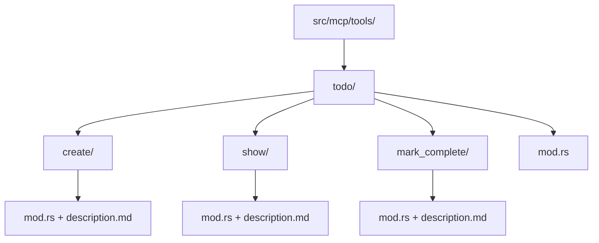

# Setup Todo Tool Module Structure

Refer to ./specification/todo_tool.md

## Overview
Set up the foundational module structure for the todo tool following established MCP tool patterns in the codebase.

## Tasks
1. Create `src/mcp/tools/todo/` directory structure
2. Set up module hierarchy following the noun/verb pattern:
   - `todo/create/` - for todo creation functionality
   - `todo/show/` - for todo retrieval functionality  
   - `todo/mark_complete/` - for marking todos as done
3. Create initial `mod.rs` files with proper module declarations
4. Update parent `src/mcp/tools/mod.rs` to include todo module

## Architecture Diagram

## Success Criteria
- Directory structure matches existing patterns (issues/, memoranda/)
- Module declarations compile without errors
- Foundation ready for tool implementations
- Follows established codebase conventions

## Implementation Notes
- Use existing tools as reference: `memoranda/create/`, `issues/create/`
- Ensure module visibility and exports are correct
- No tool logic implementation in this step - just structure