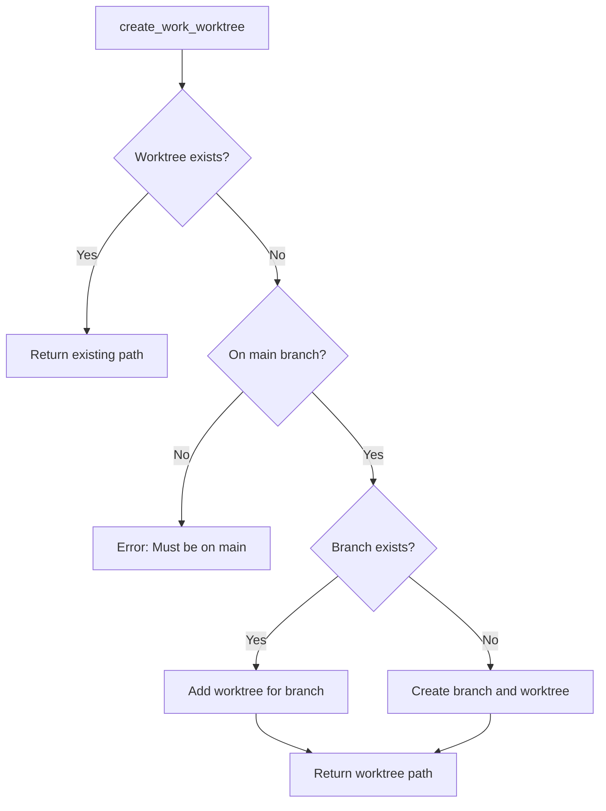

# Create Work Worktree Operation

## Overview
Implement the `create_work_worktree` method that creates a worktree for an issue, replacing the current in-place branch creation. This builds on the foundational worktree commands from the previous step.

## Implementation

### Add create_work_worktree Method (`src/git.rs`)

```rust
impl GitOperations {
    /// Create a worktree for working on an issue
    pub fn create_work_worktree(&self, issue_name: &str) -> Result<PathBuf> {
        let branch_name = format!("issue/{issue_name}");
        let worktree_path = self.get_worktree_path(issue_name);
        let current_branch = self.current_branch()?;
        let main_branch = self.main_branch()?;

        // Early return: If worktree already exists for this issue
        if worktree_path.exists() && self.worktree_exists(&worktree_path)? {
            return Ok(worktree_path);
        }

        // Validate we're on main branch (preserve existing validation logic)
        if current_branch != main_branch {
            return Err(SwissArmyHammerError::Other(
                "Must be on main branch to create issue worktree".to_string()
            ));
        }

        // Ensure worktree base directory exists
        self.ensure_worktree_base_dir()?;

        // Handle existing branch: create worktree for it
        if self.branch_exists(&branch_name)? {
            self.add_worktree(&worktree_path, &branch_name)?;
            return Ok(worktree_path);
        }

        // Create new branch and worktree
        self.create_branch_with_worktree(&branch_name, &worktree_path)?;
        
        Ok(worktree_path)
    }

    /// Create a new branch with an associated worktree
    fn create_branch_with_worktree(&self, branch_name: &str, worktree_path: &Path) -> Result<()> {
        // First create the branch
        let output = Command::new("git")
            .current_dir(&self.work_dir)
            .args(["branch", branch_name])
            .output()?;

        if !output.status.success() {
            let stderr = String::from_utf8_lossy(&output.stderr);
            return Err(SwissArmyHammerError::git_command_failed(
                "branch",
                output.status.code().unwrap_or(-1),
                &stderr,
            ));
        }

        // Then create the worktree
        self.add_worktree(worktree_path, branch_name)?;
        
        Ok(())
    }
}
```

### Error Handling Enhancements

Add specific error cases for worktree operations:

```rust
impl SwissArmyHammerError {
    pub fn worktree_creation_failed(issue_name: &str, details: &str) -> Self {
        SwissArmyHammerError::Other(format!(
            "Failed to create worktree for issue '{}': {}",
            issue_name, details
        ))
    }
}
```

## Mermaid Diagram



## Dependencies
- Requires WORKTREE_000209 (config and base)
- Requires WORKTREE_000210 (git worktree commands)

## Testing
1. Test creating worktree for new issue
2. Test creating worktree for existing branch
3. Test validation when not on main branch
4. Test idempotency (calling twice returns same path)

## Context
This step implements the core worktree creation logic but doesn't modify any existing tools yet. It provides a parallel implementation alongside the existing `create_work_branch` method.