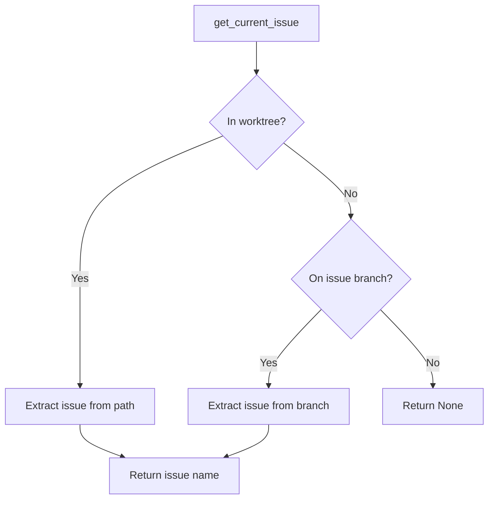

# Worktree Status Detection

## Overview
Implement methods to detect the current active worktree and determine which issue is being worked on. This enables the `issue_current` tool to work with worktrees.

## Implementation

### Add Worktree Detection Methods (`src/git.rs`)

```rust
impl GitOperations {
    /// Get the current worktree if we're in one
    pub fn get_current_worktree(&self) -> Result<Option<String>> {
        // Get the absolute path of current working directory
        let cwd = std::env::current_dir()
            .context("Failed to get current directory")?;
        
        // List all worktrees
        let worktrees = self.list_worktrees()?;
        
        // Check if we're in a worktree directory
        for worktree in worktrees {
            if cwd.starts_with(&worktree.path) {
                // Extract issue name from worktree path
                if let Some(file_name) = worktree.path.file_name() {
                    let name = file_name.to_string_lossy();
                    if let Some(issue_name) = name.strip_prefix("issue-") {
                        return Ok(Some(issue_name.to_string()));
                    }
                }
            }
        }
        
        // Check if any worktree exists in our standard location
        let worktree_base = self.get_worktree_base_dir();
        for worktree in worktrees {
            if worktree.path.starts_with(&worktree_base) {
                if let Some(file_name) = worktree.path.file_name() {
                    let name = file_name.to_string_lossy();
                    if let Some(issue_name) = name.strip_prefix("issue-") {
                        return Ok(Some(issue_name.to_string()));
                    }
                }
            }
        }
        
        Ok(None)
    }

    /// Get issue name from current context (branch or worktree)
    pub fn get_current_issue(&self) -> Result<Option<String>> {
        // First check if we're in a worktree
        if let Some(issue_name) = self.get_current_worktree()? {
            return Ok(Some(issue_name));
        }
        
        // Fall back to branch-based detection for backward compatibility
        let current_branch = self.current_branch()?;
        let config = Config::global();
        
        if let Some(issue_name) = current_branch.strip_prefix(&config.issue_branch_prefix) {
            Ok(Some(issue_name.to_string()))
        } else {
            Ok(None)
        }
    }

    /// Get all active issue worktrees
    pub fn list_issue_worktrees(&self) -> Result<Vec<IssueWorktree>> {
        let worktrees = self.list_worktrees()?;
        let worktree_base = self.get_worktree_base_dir();
        let mut issue_worktrees = Vec::new();
        
        for worktree in worktrees {
            if worktree.path.starts_with(&worktree_base) {
                if let Some(file_name) = worktree.path.file_name() {
                    let name = file_name.to_string_lossy();
                    if let Some(issue_name) = name.strip_prefix("issue-") {
                        issue_worktrees.push(IssueWorktree {
                            issue_name: issue_name.to_string(),
                            path: worktree.path.clone(),
                            branch: worktree.branch.clone(),
                        });
                    }
                }
            }
        }
        
        Ok(issue_worktrees)
    }
}
```

### Add IssueWorktree Struct

```rust
#[derive(Debug, Clone)]
pub struct IssueWorktree {
    pub issue_name: String,
    pub path: PathBuf,
    pub branch: Option<String>,
}
```

## Mermaid Diagram



## Dependencies
- Requires WORKTREE_000210 (git worktree commands)

## Testing
1. Test detection when in a worktree
2. Test detection when on issue branch (backward compatibility)
3. Test listing all issue worktrees
4. Test when not in issue context

## Context
This step adds detection capabilities without changing the tool behavior yet. It provides methods that can detect both worktree and branch-based workflows for a smooth transition.